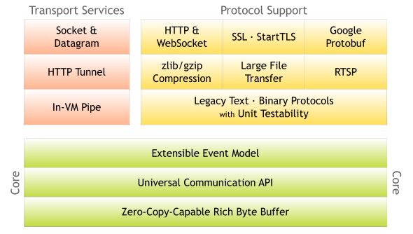

## 前言

* 通常，我们学习一个新技术时。最需要做的一件事就是看官方的《User Guide》文档，每一种技术都会在官网中介绍它是什么？它解决的问题（痛点）是什么？它有哪些优点？今天，咱们就朝着这三个方向去看官方文档。
* 一般情况下，我们是先介绍它是什么，然后再说明它解决了哪些问题，有哪些优点。而在[Netty的官方文档中《User Guide》](https://netty.io/wiki/user-guide-for-4.x.html)中，它为我们提供的阅读思路是：**先列出目前有哪些问题，然后是Netty针对这些问题的解决方案，最后是教我们写hello world程序**。

### 一、Netty官网中列出了哪些问题？

* 先引用官网中的原文[https://netty.io/wiki/user-guide-for-4.x.html#the-problem](https://netty.io/wiki/user-guide-for-4.x.html#the-problem)：

  > Nowadays we use general purpose applications or libraries to communicate with each other. For example, we often use an HTTP client library to retrieve information from a web server and to invoke a remote procedure call via web services. However, a general purpose protocol or its implementation sometimes does not scale very well. It is like how we don't use a general purpose HTTP server to exchange huge files, e-mail messages, and near-realtime messages such as financial information and multiplayer game data. What's required is a highly optimized protocol implementation that is dedicated to a special purpose. For example, you might want to implement an HTTP server that is optimized for AJAX-based chat application, media streaming, or large file transfer. You could even want to design and implement a whole new protocol that is precisely tailored to your need. Another inevitable case is when you have to deal with a legacy proprietary protocol to ensure the interoperability with an old system. What matters in this case is how quickly we can implement that protocol while not sacrificing the stability and performance of the resulting application.

* 全是英文，感到头痛？没事，咱们来剖析它。这段英文段落的大致结构分为：

  > 1、信息传输的通用方式
  >
  > 2、通用的HTTP协议来进行信息传输扩展性、实时性不高
  >
  > 3、需要自己去设计一个高性能的HTTP协议来达到传输大文件、媒体流、多人游戏的使用场景
  >
  > 4、如何自己去设计自定义的协议来达到特殊的业务需求
  >
  > 5、如何在保证稳定性的同时并且提供应用程序的性能

* 其实，整个内容阅读下来最核心的几个东西就是：**高性能、高性能、实时性、扩展性、自定义协议、快速开发**。而针对这几个核心问题的处理方案，Netty则开发出了Netty框架。

### 二、问题的解决方案

* Netty的解决方案非常简单粗暴，直接就是开发出了Netty框架。在[官方文档中：点击跳转](https://netty.io/wiki/user-guide-for-4.x.html#the-problem)主要介绍了Netty是什么，有什么优点。其如下原文则很完美的介绍了**Netty到底是什么**：

  > *[The Netty project](https://netty.io/)* is an effort to provide an asynchronous event-driven network application framework and tooling for the rapid development of maintainable high-performance and high-scalability protocol servers and clients.

  **它是一个努力提供异步事件驱动的网络应用程序的框架和工具，它可以快速开发高性能和高扩展性协议的服务端和客户端**。而它的另一段原文：

  > In other words, Netty is an NIO client server framework that enables quick and easy development of network applications such as protocol servers and clients. It greatly simplifies and streamlines network programming such as TCP and UDP socket server development. It greatly simplifies and streamlines network programming such as TCP and UDP socket server development.

  也说明了它是基于Java 的NIO进行二次封装，将使用NIO开发网络应用程序的繁杂工作量给封装了起来，给我们提供了一个**简单、快速**开发网络应用程序的优点。一般**简单快速**开发出来的应用程序，都会面临着**维护和性能**之前的问题。但Netty的**简单快速**却不会面临，因为Netty在大量的协议的设计中，非常小心且学习了非常多的经验，比如：FTP、SMTP、HTTP和各种二进制基于文本的传统协议。Netty在不妥协的情况下，已经成功的找到一种**简单开发、高性能、高稳定性、高灵活性**的方式。

### 三、为什么使用Netty

* 市面上存在其他的开发网络应用程序的框架，那为什么要用Netty呢？这里需要引用官网的一段话：

  > Some users might already have found other network application frameworks that claim to have the same advantage, and you might want to ask what makes Netty so different from them. The answer is the philosophy it is built on. Netty is designed to give you the most comfortable experience both in terms of the API and the implementation from day one. It is not something tangible but you will realize that this philosophy will make your life much easier as you read this guide and play with Netty.

  Netty非常自信，官网说选择netty的主要原因是因为它的**哲学**。Netty声称：**它一开始设计的一套API，能让你在使用和实现上得到非常舒适的体验。**。那究竟能不能有舒适的体验，还是要我们在使用Netty时才能感受到。

### 四、Netty的特性梳理

* 从[官网](https://netty.io/)的角度来理性的认识Netty的一些特性

#### 设计层面

* **针对阻塞或非阻塞的socket的传输模式都有统一的api**  ===>  将socket的相关操作都进行了抽象
* **基于灵活的，可扩展的事件模型，可以让我们清晰的分离关注点**  ===>  将我们需要关注的点都进行了分离，解耦
* **可定制的线程模型，不管你是单线程模型、多线程模型还是主从线程模型，都支持**  ===> 将reactor线程模型做到配置化，扩展性高

#### 简单使用层面

* **官方文档、javadoc以及官网的案例都能让你快速上手netty**  ===> 文档齐全
* **没有额外的依赖，`Netty3.x`版本仅依赖jdk 1.5，而Netty 4.x 仅需依赖jdk1.6 **  ===> 无过度依赖，轻量

#### 性能

* **高吞吐量、底延迟**
* **更少的资源消耗**
* **最小化的内存复制**

#### 安全

* **对SSL/TLS以及StartTLC的支持**

#### 社区

* **社区活跃，早发布，常发布**

#### Netty框架架构

* 

  正如官网的介绍一样，Netty实现了对多种协议的主持：**HTTP、SSL、StartTLS、二进制传统协议**。同时，它的核心组件：**可扩展的事件模型、通用的通信API、零拷贝的缓冲区**是它**高吞吐量、低延迟**的核心。详细的结构框架可参考官网的[第二章：架构概述](https://netty.io/3.8/guide/#architecture)

### 五、总结

* **学习一个技术得从官网着手，了解其技术出现的原因，解决了什么样的痛点，有哪些优势。对于Netty而言，我们只需要记住：`它能够为我们提供一套简单统一的api，能极大的提高网络应用程序的开发效率即可`**
* **下篇文章将从官网demo开始，从官网的discard 和time 协议的实现开始编写netty程序**
* **如果你觉得我的文章有用的话，欢迎点赞、收藏和关注。:laughing:**
* **I'm a slow walker, but I never walk backwards**

