# 前言

* 在[上篇文章：IO系列学习总结七：从官网Factorial协议的视角来理解出站、入站及数据碎片化（粘包拆包）](待填写)中，针对Factorial协议做了一些解析，其中包含netty的入站出站处理顺序以及粘包拆包的概念及处理方案。在Factorial协议的拆包粘包部分总结的可能还有点模糊，接下来我们针对netty的聊天程序做一个简单的demo，把拆包粘包的现象给展示出来，同时并给予对应的解决方案。话不多说，我们直接看下面的内容。

## 一、实现聊天室的基本思路

* 先说说这个聊天室的基本功能：**启动服务器，当用户A上线，服务器则通知除用户A以外的其他用户：`用户A上线了`。同时，位于聊天室的任意一个成员发送一条消息时，所有人都会收到对应的消息（包括自己），当用户A下线了，需要通知其他用户：`用户A下线了`。**

* 实现思路：

  > 1. 根据我们之前netty的学习可知，客户端每次连接服务端都会有一条新的channel建立，因此，**我们需要在服务器端维护好所有的channel**
  > 2. 聊天室是基于字符串进行传输的，因此，**我们需要在客户端和服务器端都要添加String类型的编解码器**
  > 3. 整个功能会有是三个触发节点：**用户上线、用户发消息、用户下线**，其对应服务端的事件回调方法就是：**channelActive、channelRead、channelInactive**方法。因此，我们需要在这三个方法中**广播消息给所有的客户端**

* ok，了解了上述思路后，我们来看看代码的实现

## 二、先分析代码，再看拆包粘包现象

### 2.1  服务端handler  - ChatServerHandler

* 其主要的逻辑包含了上述的3个实现思路，内部重写了**channelActive、channelRead0、channelInactive**方法，这里重写channelRead0方法的原因是：**SimpleChannelInboundHandler**为我们提供了扩展功能，能够让我们自定义的处理读取到的消息。具体祥看下列代码中的注释：

  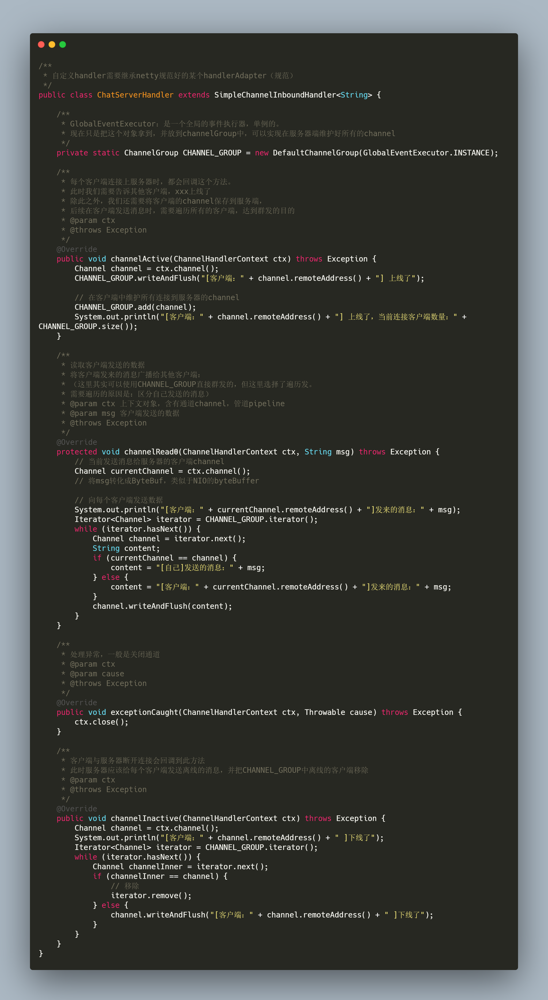

### 2.2 服务端启动入口 - ChatServer

* 其主要功能就是为建立到服务端的客户端的channel添加了一些handler（字符串的编解码以及服务端的handler），但需要保证字符串的编解码器得在服务端的handler前面添加。具体祥看下图及注释：

  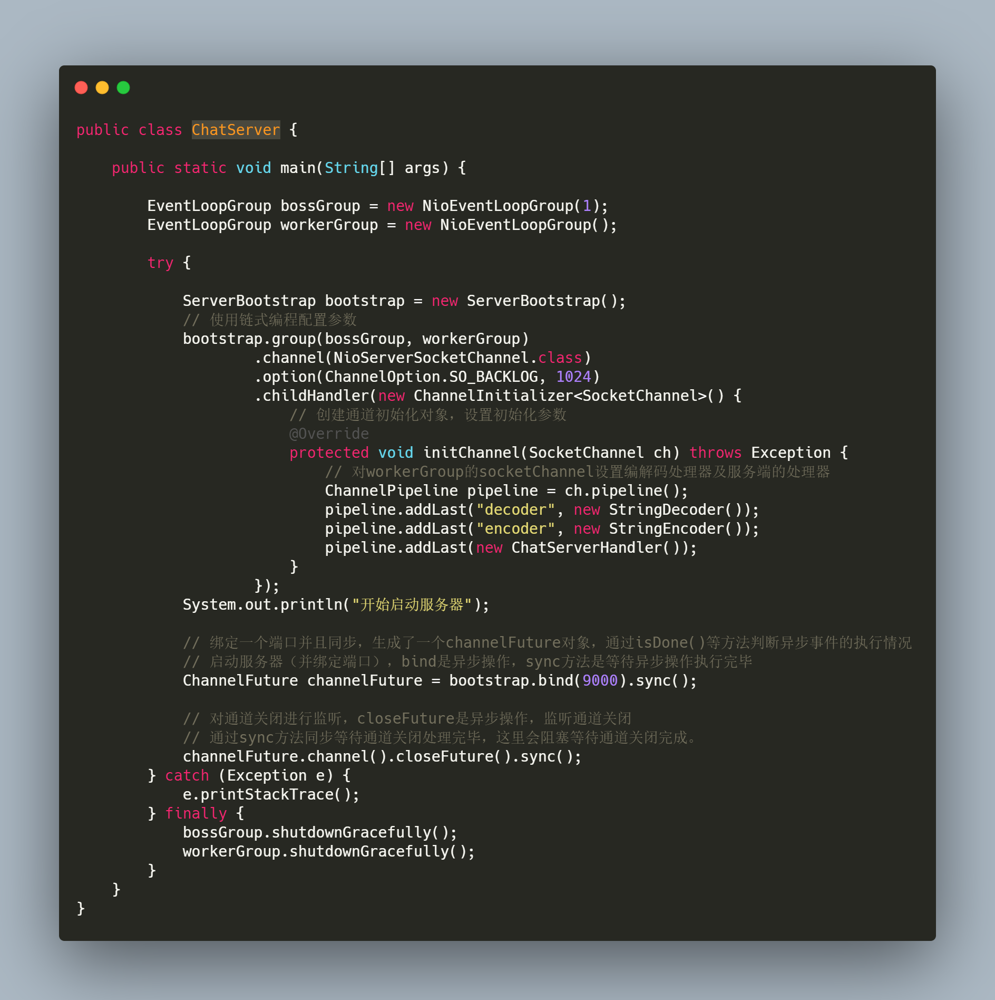

### 2.3 客户端的处理器  - ChatClientHandler

* 客户端的处理器超级简单，**仅仅是输出字符串信息**。它能正常接收字符串的原因是因为在客户端中配置了执行性此handler之前进行了解码操作。

  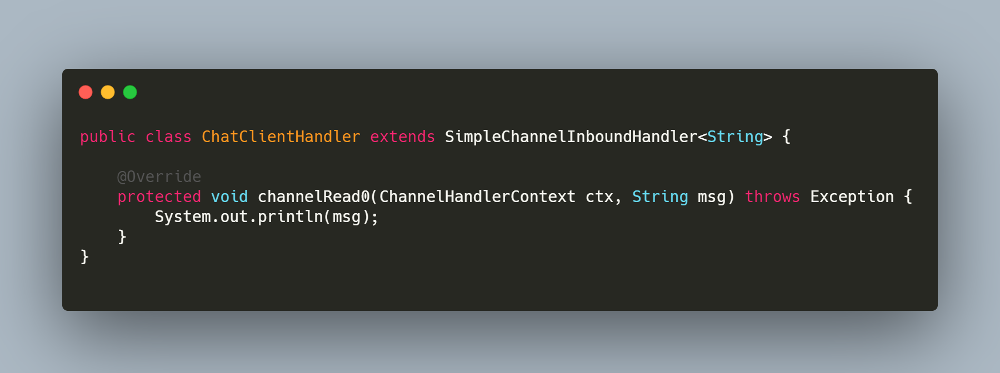

### 2.4 客户端的启动入口 - NettyClient

* 但需要有一个注意点就是：编解码的处理器得放在客户端处理器前面，这样才能保证客户端的处理器处理的数据是解码后的数据。详看下图代码注释：

  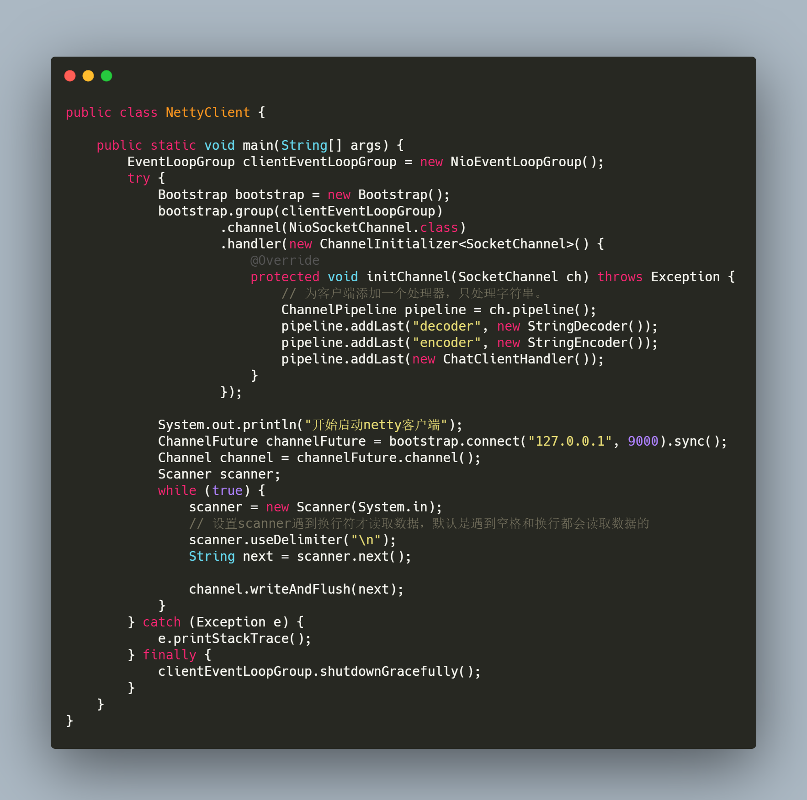

### 2.5  重现拆包粘包情况

* 重现步骤：

> 1. 分别启动服务端、客户端，得到**server-1**和**client-1**
>
> 2. 将客户端NettyClient中如下代码：
>
>    ```java
>    while (true) {
>        scanner = new Scanner(System.in);
>        // 设置scanner遇到换行符才读取数据，默认是遇到空格和换行都会读取数据的
>        scanner.useDelimiter("\n");
>        String next = scanner.next();
>    
>        channel.writeAndFlush(next);
>    }
>    ```
>
>    替换成如下代码：
>
>    ```java
>    for (int i = 0; i < 200; i++) {
>        channel.writeAndFlush("兄弟 你好呀！我是avengerEug");
>    }
>    ```
>
>    并重新启动。得到**client-2**
>
> 3. 查看**server-1和client-1**的控制台，看打印的数据是否正常。

* 本人重复上面的2-3步骤，一共重复了2次（读者可以多尝试几次），在**server-1和client-1**控制台查看到的结果如下所示：

  * 第一次测试：

    server-1控制台：

    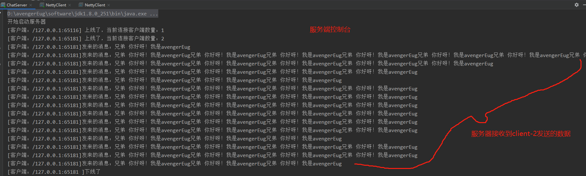

    client-1控制台：

    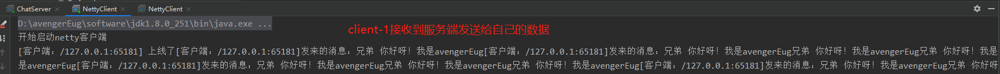

  * 第二次测试：

    server-1控制台：

    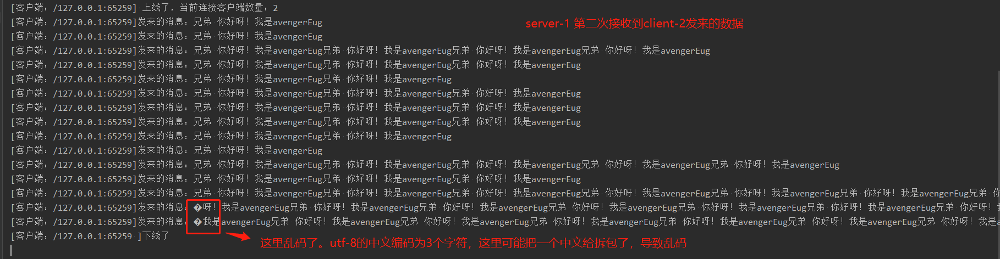

    client-1控制台：

    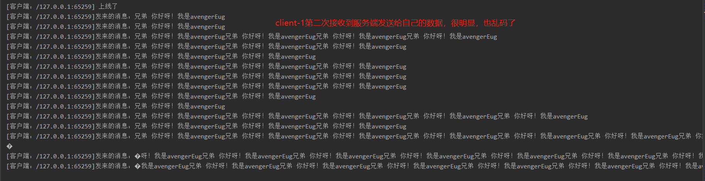

* 通过上述的实验，拆包粘包的现象很明显的出来了。那如何解决这个问题呢？

## 三、使用特殊的数据包解决拆包粘包现象。

* 解决思路：同上篇文章一样，我们发送给对方的数据是量身定做的，其中包含两个主要信息：

  > 1. 数据包长度（int数据类型：它的值就是下面byte数组的长度）
  > 2. 数据包内容（byte数组：它的值就是我们要发送字符串的字节数组）

  服务端与客户端的主要职责就是解析这个**特殊的数据包**。举个栗子：我们要发送**兄弟 你好呀！我是avengerEug**字符串，我们可以组装这个数据包，其最主要的两个部分的内容分别是：

  > 1. 数据包长度：（int数据类型：假设为200）
  > 2. 数据包内容：（**兄弟 你好呀！我是avengerEug**字符串的字节数组表现形式）

  有了上述思路后，我们来梳理下要这样做有哪些改动：

  > 1. 要传输特殊的数据包，因此我们需要编写**自定义类型的编解码器。**
  > 2. 修改服务端、客户端发包逻辑，**组装成自定义的数据包**

  话不多说，我们直接进行改造。

### 3.1 定义特殊数据包结构   - ChatPacket

* 如上述分析一致，其主要属性包含**数据包长度 和 数据包内容**

* 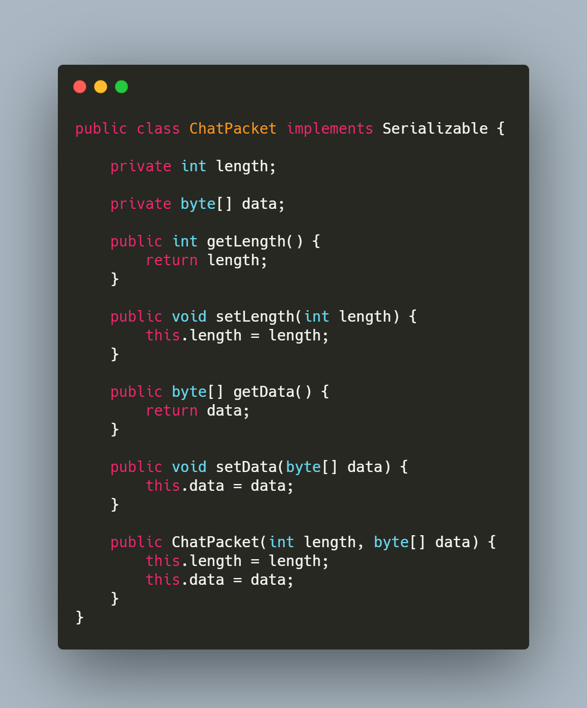

### 3.2  特殊数据包的编码器 - ChatEncoder

* 编码器的逻辑也比较简单，就是将 ChatPacket 特殊数据包写到字节数据中去
* 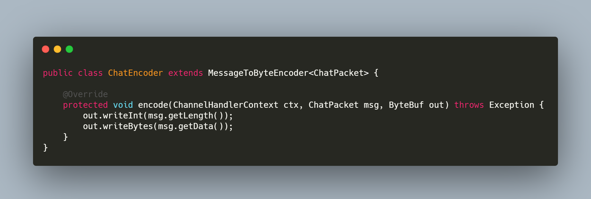

### 3.3 特殊数据包的解码器 - ChatDecoder

* 它的逻辑比编码器多一点，但其主要目的还是将字节数组转成ChatPacket，但需要注意拆包粘包的情况，因此有一些特殊逻辑，祥看如下代码即注释：

  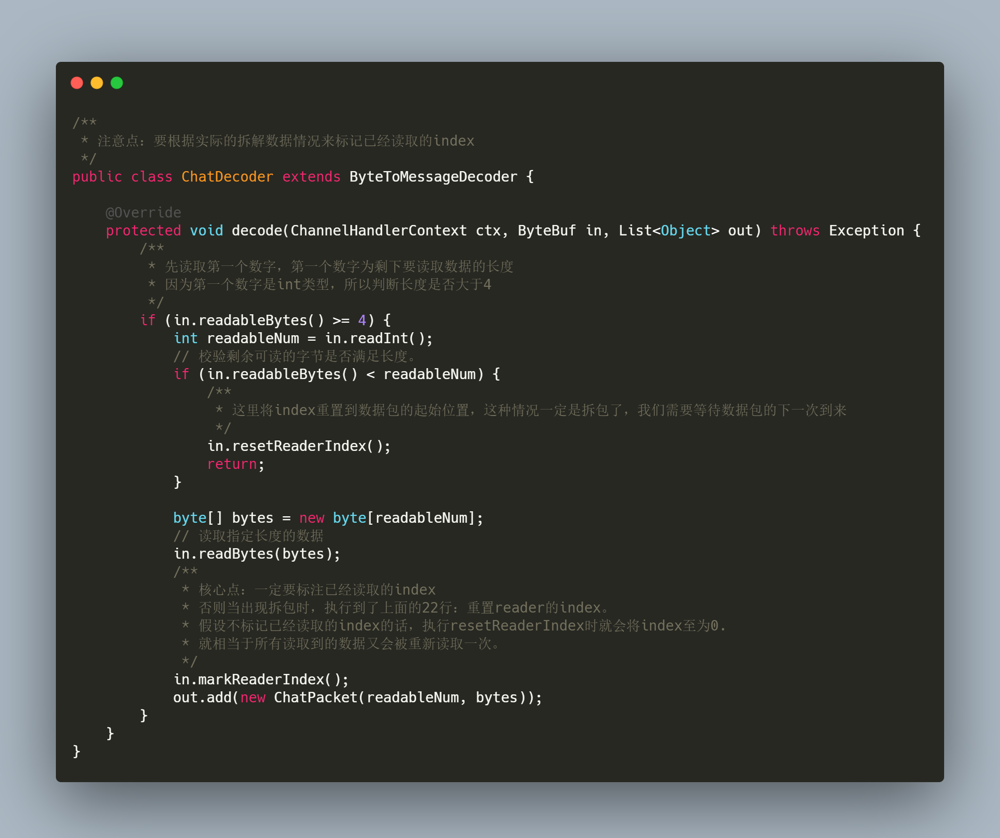

### 3.4 服务端处理器 - ChatServerHandler

* 与之前拆包粘包版本的handler逻辑基本一致，唯一变化的就是写数据时，需要转化成对应的ChatPacket类型，其代码如下所示：

  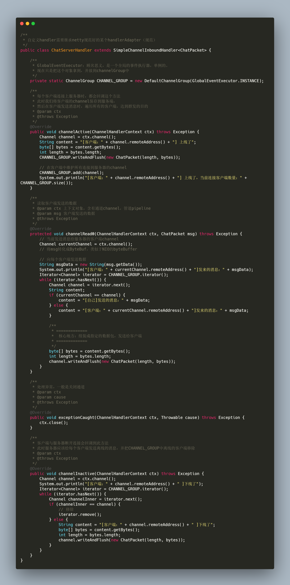

### 3.5 客户端handler - ChatClientHandler 

* 逻辑比较简单，就是提取特殊数据包chatPaket内部的字符串信息

  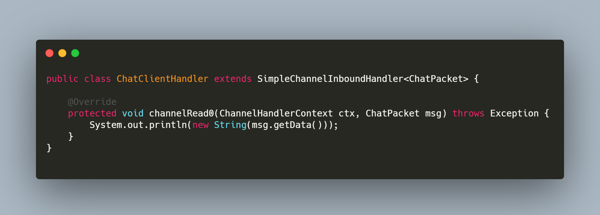

### 3.6 客户端入口 & 服务端入口

* 这两个类的处理逻辑比较简单，就是添加了特殊数据包的编解码器。

* 客户端入口：

  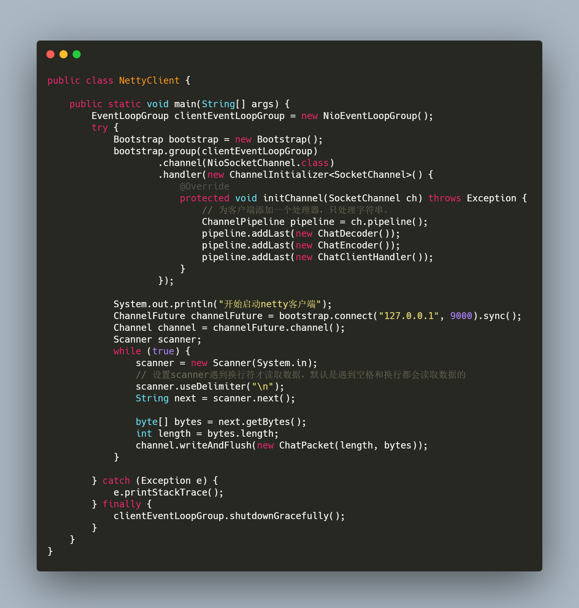

* 服务端入口：

  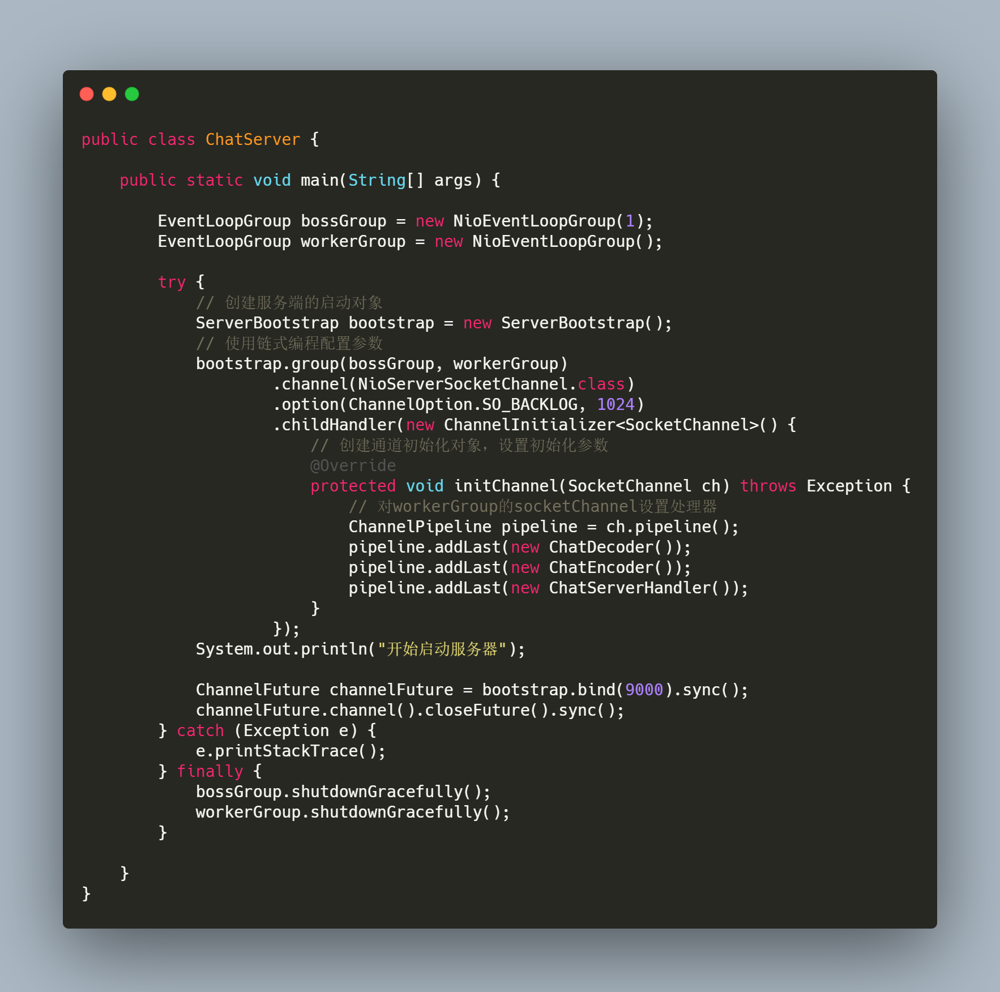

### 3.7 测试拆包粘包情况

* 可按照上述 **重现拆包粘包情况**的步骤进行重现，其收发数据时，基本上是一条一条的发，其测试结果如下所示：

  server-1控制台

  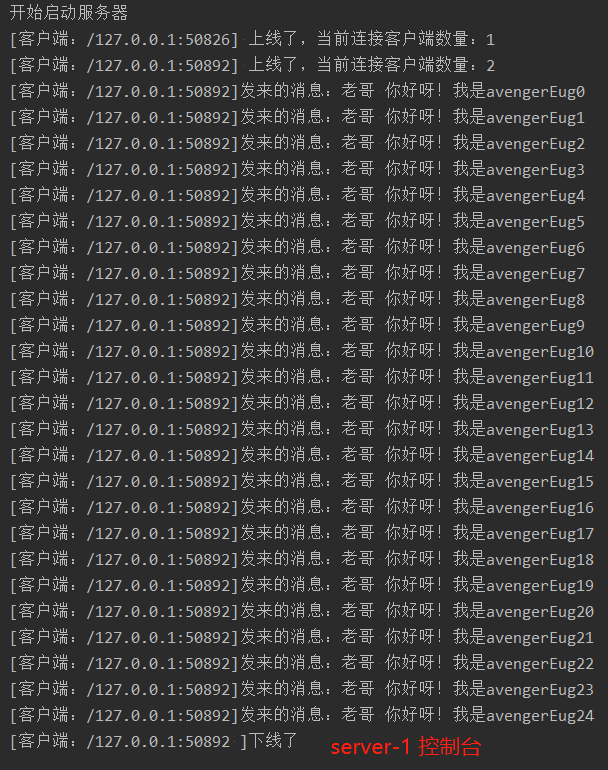

  client-1控制台

  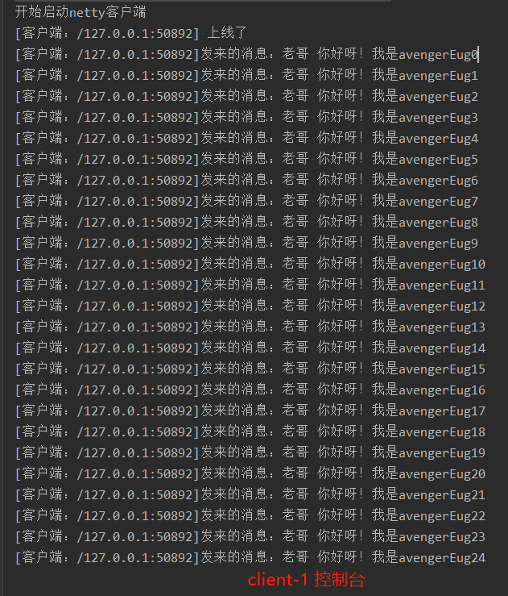

  客户端循环发送了25次，服务器已经其他客户端收到的信息也是25条，已完美解决拆包粘包情况

## 四、总结

* **本次总结涉及的图片比较多，但它能帮助我们更好的理解netty对于拆包粘包的解决方案。这次，我们通过简单的聊天程序近距离的看到了拆包粘包导致的现象以及解决方案。相关的代码地址：[点击跳转](https://github.com/AvengerEug/javase/tree/develop/src/main/java/io/netty/funcdemo/chat)**
* **如果你觉得我的文章有用的话，欢迎点赞、收藏和关注。:laughing:**
* **I'm a slow walker, but I never walk backwards**

