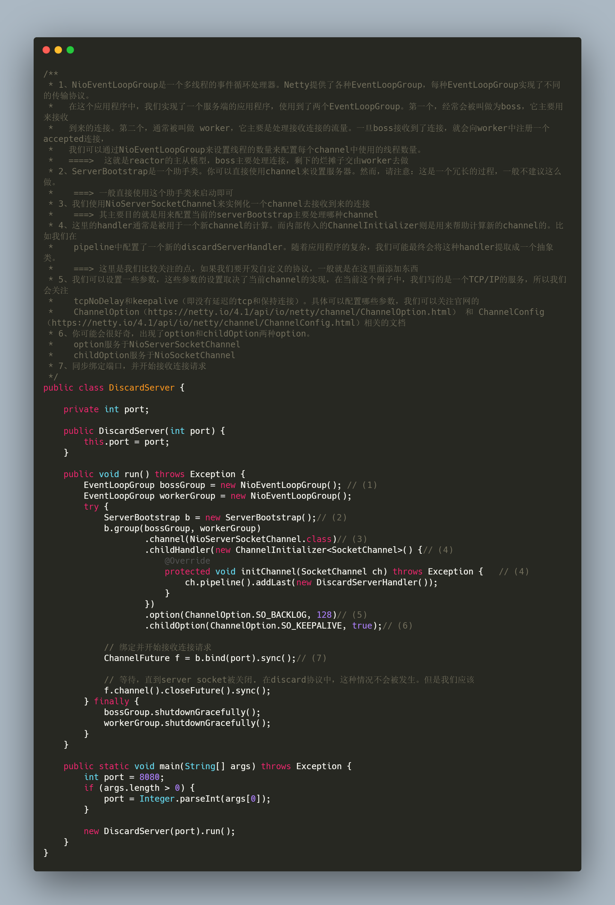
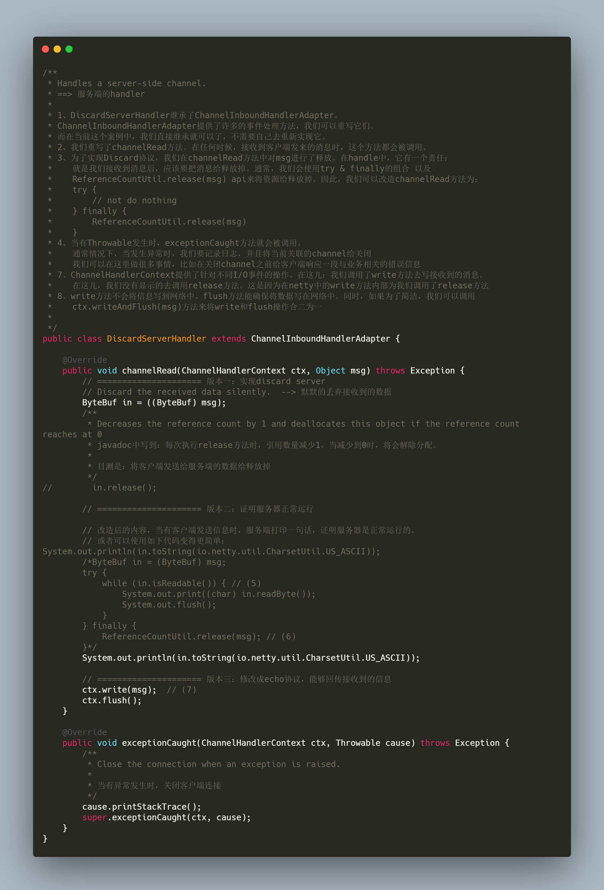
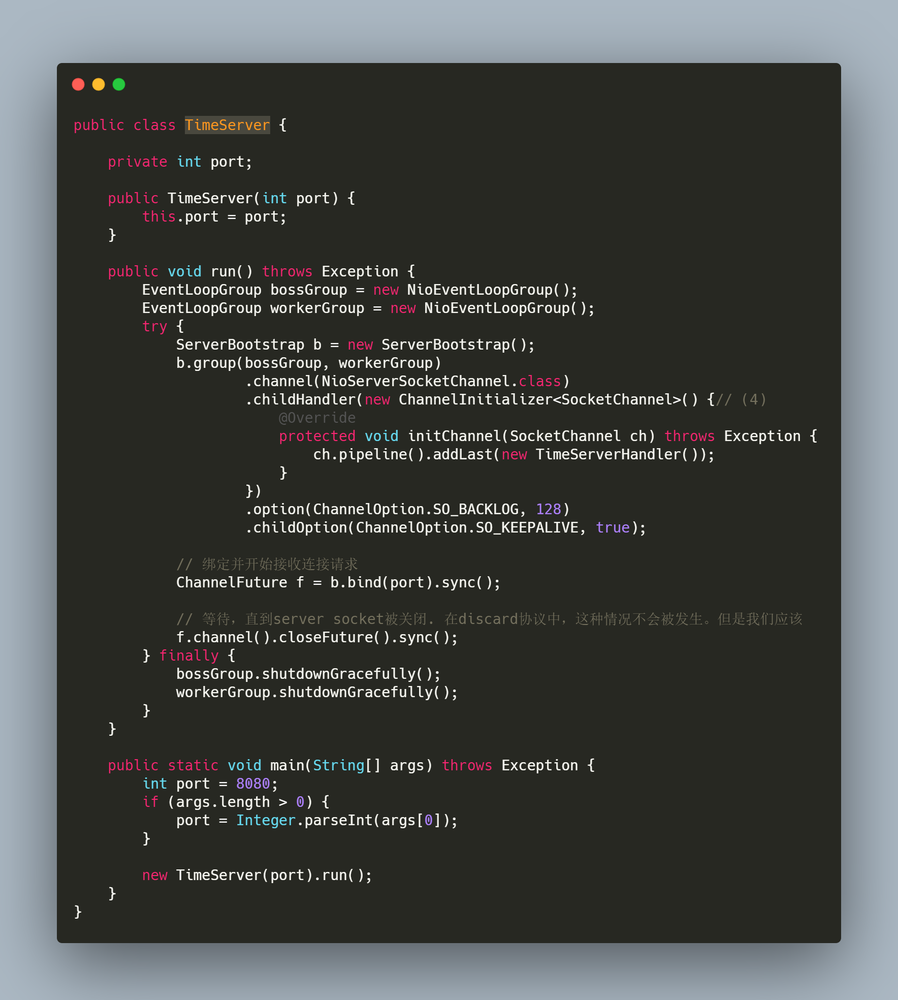
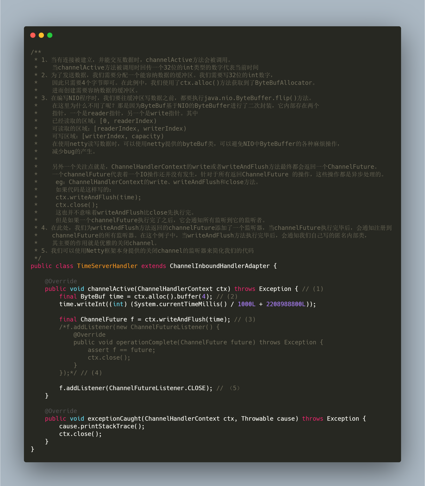
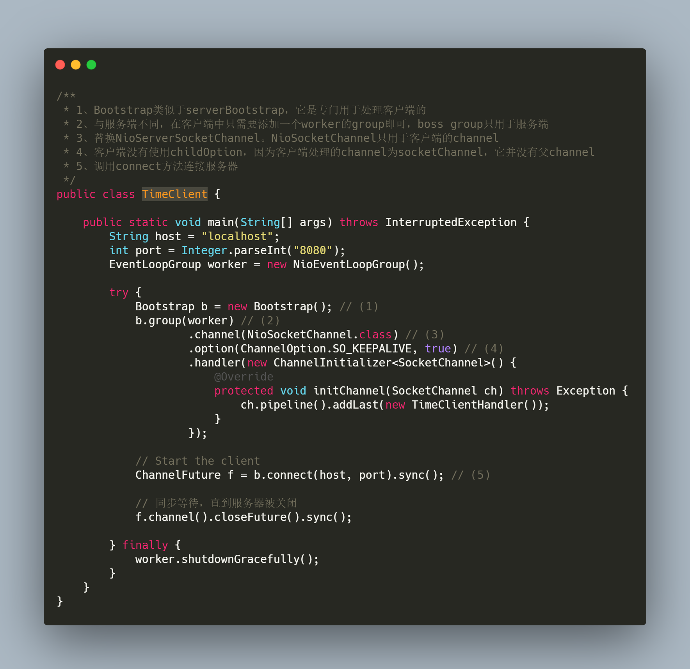
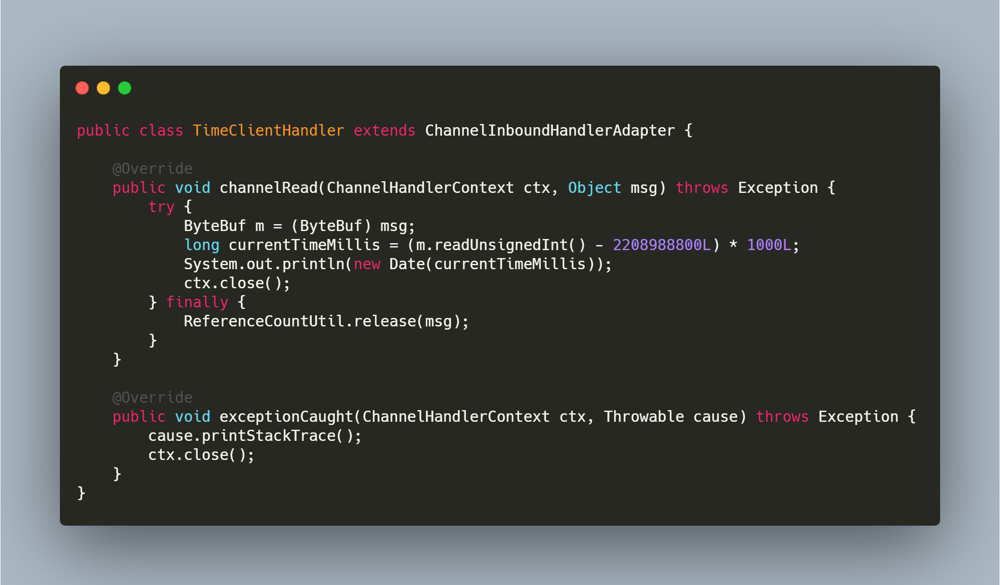
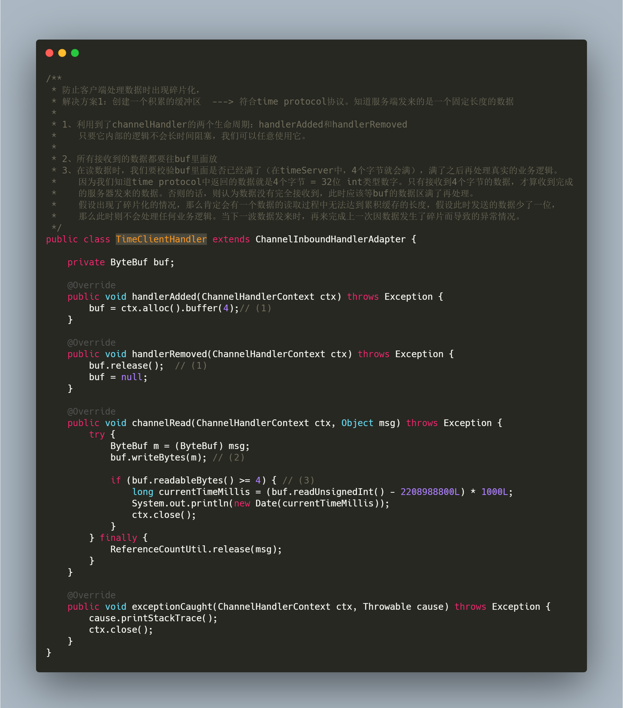
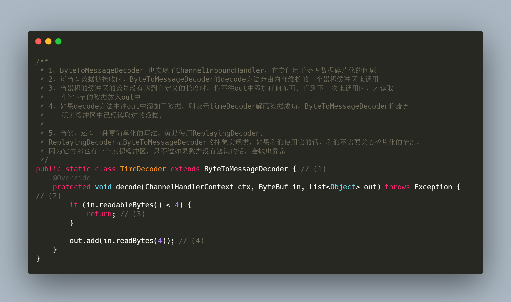
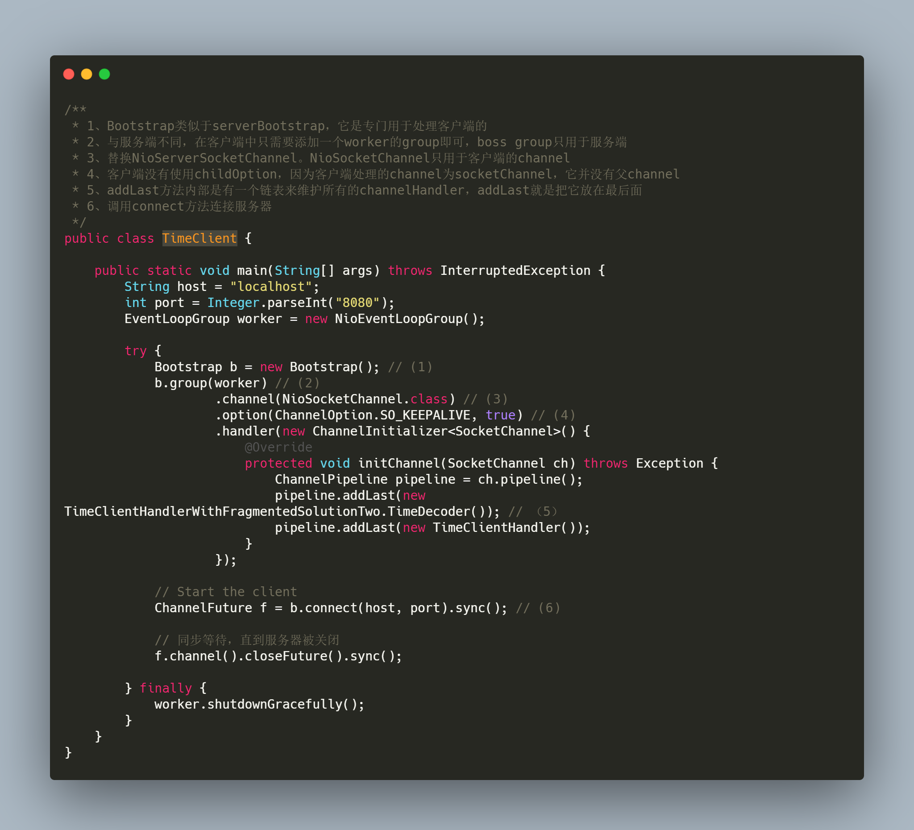

# 前言

* 对于Netty这种通讯框架而言，它最简单的一个实现（**也就是我们常说的Hello World程序**）也得需要客户端和服务端进行通讯，而这实际上就是一种**协议**。在Netty官网中有提到，最简单的协议实现就是：**Discard Protocol**，在这种协议下，服务端和客户端不需要做任何事情。它的最主要功能就是：**接收客户端的请求，但是却丢弃它**。通过**Discard Protocol**的入门程序编写，我们可以了解Netty的开发模式。当然，Netty是一个通讯的框架，我们最后还得通过官网的**Time Protocol**来了解Netty是如何传输信息的、如何自定义编解码器来帮助我们实现自定义协议。
* 注意：下列内容中的注释包含1、2、3.....序号，它与代码后面（1）、（2）、（3）......一一对应

## 一、两张图解释Discard protocol核心代码含义

* 服务端启动入口：**DiscardServer**

  

* DiscardServer服务的处理器：**DiscardServerHandler**

  

* DiscardServerHandler的版本一共有三个，每个版本都是对discard 协议的一种优化

### 版本一：默默丢弃

* 此版本的代码实现非常简单，直接将读到的数据给释放了。代码如下：

  ```java
  ByteBuf in = ((ByteBuf) msg);
  in.release();
  ```

* 我们如何证明服务器是正常运行的呢？可以使用**telnet**命令（**如下两个版本也使用同样的方式证明**）

### 版本二：证明服务器正常运行

* 在**版本一**中，我们无法证明服务器是否正常运行，因此我们需要将客户端发来的数据打印出来，来证明服务器是正常运行的。在这种情况下，我们对DiscardServerHandler进一步改造，改造代码如下：

  ```java
  ByteBuf in = (ByteBuf) msg;
  try {
      while (in.isReadable()) { // (5)
          System.out.print((char) in.readByte());
          System.out.flush();
      }
  } finally {
      ReferenceCountUtil.release(msg); // (6)
  }
  
  // 或使用更简单的方式
  ByteBuf in = (ByteBuf) msg;
  System.out.println(in.toString(io.netty.util.CharsetUtil.US_ASCII));
  ```

### 版本三：证明服务器和客户端互相通信

* 在版本二中，就算我们在channelRead方法中将客户端发来的话打印出来以证明服务器能正常接收到客户端的数据，但是我们无法证明客户端是否能接收到服务端发来的消息，即无法证明客户端和服务器的通讯是**互相**正常的。在这种情况下，我们对DiscardServerHandler进一步改造，改造代码如下：

  ```java
  // 添加会写数据代码
  ctx.write(msg); 
  ctx.flush();
  ```

* 在此版本中，服务器向客户端回传了数据，这里使用了write方法。需注意：write方法只是将数据写到了缓存区中，此时并未将数据写到网络中去，需要使用flush方法实现此功能。此时的版本三，在Netty官网中，称它为：**[ECHO Protocol 点击查看官网](https://netty.io/wiki/user-guide-for-4.x.html#writing-an-echo-server)**。

## 二、Time protocol协议的实现

* 在官网中，针对Time protocol协议的demo一共做了四次优化，分别是：**基本功能版本、修复碎片化功能版本（包含两种解决方案）、使用pojo传输信息版本**。咱们的就按部就班的跟着官网的demo来，还是能学到很多东西的。其Time protocol的demo主要功能为：**只要有客户端连接到服务器，服务器就把当前的时间响应给客户端。**

### 2.1 基本功能版本

* 此版本也比较简单，服务端代码比较简单，与Discard protocol的服务端代码相比，只有对应的**handle**不一样。其代码如下所示：

  

* 服务端handler

  

* 客户端代码

  

* TimeClientHandler代码

  

  time protocol协议的基本代码如上所示，总共分为：**服务端 & 服务端handler + 客户端 & 客户端handler**。其主要的一些点都在注释中有描述，可以仔细阅读。就这么一个简单的程序可能会存在数据包**碎片化**的问题（**这个问题需要牢牢记住，它应该就是Netty所谓的粘包拆包了**）

* 基础功能版本对应的代码地址：[https://github.com/AvengerEug/javase/tree/develop/src/main/java/io/netty/funcdemo/official/timeserver/version1](https://github.com/AvengerEug/javase/tree/develop/src/main/java/io/netty/funcdemo/official/timeserver/version1)

### 2.2 netty数据包的碎片化情况

* 先说说为什么会出现**碎片化**的情况，这里引用下官网的解释：

  > In a stream-based transport such as TCP/IP, received data is stored into a socket receive buffer. Unfortunately, the buffer of a stream-based transport is not a queue of packets but a queue of bytes. It means, even if you sent two messages as two independent packets, an operating system will not treat them as two messages but as just a bunch of bytes.

  大致的意思是：**基于流传输的协议，比如TCP/IP，他们都是从缓冲区中接收的。不幸的是，这个基于流协议的缓冲区不是一个数据包的队列，而是一个字节队列。这就意味着，当你发送两条单独的数据包时，操作系统可能不会向对待两个数据包的形式去对待，而是以一串字节的数据来对待。**这会出现什么情况呢？举个例子：假设你发送的数据包是下面这样的，一共发了三个数据包，

  

  但操作系统可能会这样处理：

  

  因此，我们需要解决这个问题。

#### 2.2.1 修复碎片化功能版本（解决方案一：使用缓存buffer）

* 在time protocol的demo中，我们知道，服务端发送给客户端的是一位int类型的数字，而int类型占用了4个字节，因此，我们只需要创建一个**缓存的buffer**，其大小为4个字节，当服务端接收到消息时，就往这个缓存的buffer中塞数据，**塞完后需要校验缓存的buffer是否已经满了**（**`因为我们知道，服务器发来的数据时4个字节为一组，就算出现了碎片化的情况，我只要保证缓存的buffer满了，那就肯定是一个完成的数据`**）。

* 针对此种解决方案，我们只需要改造TimeClientHandler为如下模样即可：

  

  每个重要部分的代码（**后面有编号**），可以详细看下注释。

* 解决方案一版本对应的代码地址：[https://github.com/AvengerEug/javase/tree/develop/src/main/java/io/netty/funcdemo/official/timeserver/version2](https://github.com/AvengerEug/javase/tree/develop/src/main/java/io/netty/funcdemo/official/timeserver/version2)

#### 2.2.2 修复碎片化功能版本（解决方案二：使用编码器）

* 针对于简单的协议而言，**解决方案一**能满足条件，但如果是一个复杂的协议的话，使用方案一的解决方案就会使得协议的扩展性降低。针对于这种情况下，官网的解决方案是：**使用编码器**处理。

* 在之前的文章也有提到，所有的程序最终都离不开**读取请求、解析请求、处理请求、编码响应内容、发送响应内容**的步骤，出现碎片化的原因就是在接收信息的情况下，操作系统可能不会按照我们期望的逻辑来处理，针对当前案例来说。不存在客户端向服务端发数据的情况，因此只有服务器向客户端发送当前日期的情况下发生碎片化情况。所以，我们需要在客户端读取数据之前，添加一个自定义的**编码器**，其编码器的主要作用就是解决读取数据的碎片化问题。

* 在方案二中，我们需要做两件事情：

  1. 编写客户端的编码器
  2. 把编码器添加到TimeClientHandler之前，优先于TimeClientHandler执行

* 编写客户端解码器：

  

* 把编码器添加到TimeClientHandler之前，优先于TimeClientHandler执行。改造TimeClient，添加TimeDecoder编码器

  

* 解决方案二版本对应的代码地址：[https://github.com/AvengerEug/javase/tree/develop/src/main/java/io/netty/funcdemo/official/timeserver/version3](https://github.com/AvengerEug/javase/tree/develop/src/main/java/io/netty/funcdemo/official/timeserver/version3)

### 2.3 传输POJO版本

* 此部分可直接参考官方文档：[https://netty.io/wiki/user-guide-for-4.x.html#speaking-in-pojo-instead-of-bytebuf](https://netty.io/wiki/user-guide-for-4.x.html#speaking-in-pojo-instead-of-bytebuf)
* 此部分的代码就不贴了，基本上也是大同小异，在编解码处做文章，其对应的demo地址如下所示：[https://github.com/AvengerEug/javase/tree/develop/src/main/java/io/netty/funcdemo/official/timeserver/version4](https://github.com/AvengerEug/javase/tree/develop/src/main/java/io/netty/funcdemo/official/timeserver/version4)

## 三、总结

* **其实这篇文章的总结没什么深度，但对于我个人而言还是挺有意义的，毕竟自己跟着官网的《User-Guide》的demo敲了一遍，并且去思考了官网中每一个标注的关键代码。还是那句话，学东西还是官网的最权威。跟着官网敲了一遍demo后，你真的就会发现，netty的开发模板以及实现自定义协议的套路了！**
* **如果你觉得我的文章有用的话，欢迎点赞、收藏和关注。:laughing:**
* **I'm a slow walker, but I never walk backwards**


