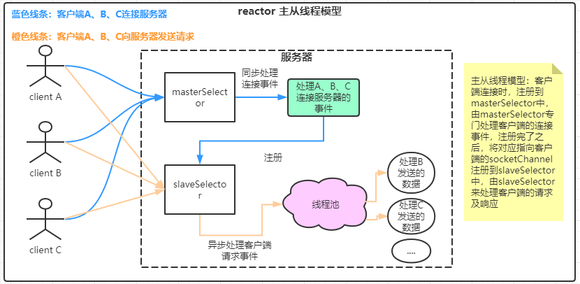

# 前言

* [上篇文章：IO系列学习总结三：三张图带你了解NIO通信程序的执行流程](https://blog.csdn.net/avengerEug/article/details/114176734)我们了解了一个普通NIO应用程序的通信执行流程。了解到了NIO的非阻塞具体体现在哪个地方。并对它的Selector、SelectedKey、Channel组件有了基础的了解。在上篇文章中的程序案例中，虽然它解决了BIO的阻塞问题，但它的吞吐量还不是特别高，因为它是单线程的。对于selector而言，它的工作太繁重了，需要管理服务端ServerSocketChannel的accept事件，还要管理连接到服务端的SocketChannel的read、write事件。大家可以仔细想一下：**假设在客户端A向服务端发送数据的同时，还有成千上万的客户端来连接客户端。那服务端的selector会不会因为先处理成千上万的客户端连接事件而导致延长了读取客户单A发来的信息时间呢？**这是肯定的，因为它就是单线程的，一个人单枪匹马的处理着ServerSocketChannel和SocketChannel的各种事件。
* 为了解决问题，[java并发之父：Doug Lea](https://baike.baidu.com/item/Doug%20Lea/6319404?fr=aladdin)基于AWT的事件原理提出了reactor模型，在他写的[Scalable IO in Java](http://gee.cs.oswego.edu/dl/cpjslides/nio.pdf)书中有提到reactor的三种线程模型：经典模型、多线程模型、多reactor模型（**关于这本书的剖析，可以在网上搜索相关的文档，在这里就不多阐述了**）。

## 一、每一个应用程序不可避免的五个步骤

* 不管是Web Service、分布式程序等等，大多数都有一个基础的流程：**读取请求、解析请求、处理请求、编码响应内容、发送响应内容**。

* 而最典型的服务模式如书中的下图所示：

  

客户端连接服务器，服务器开线程处理客户端的请求，处理过程包括上述的五个流程：**读取请求、解析请求、处理请求、编码响应内容、发送响应内容**。在这样的一个结构中，我们的线程处理请求需要经过五个步骤才能释放当前线程资源。

## 二、 reactor单线程模型

* 
* 由图中可以看出，每个客户端连接的都是服务端的一个selector。这个selector的任务非常繁重：需要处理**客户端连接服务端的事件，客户端向服务端发送数据事件、服务端向客户端回写数据事件**。在实际的应用中，`我们希望服务端能快速处理事件，而不希望因为客户端A的请求处理逻辑很长，导致客户端B的连接请求一直处于pending状态。`
* [对应的单线程模型代码地址，点击跳转访问](https://github.com/AvengerEug/javase/blob/develop/src/main/java/io/nio/singlereactor/SingleReactorServer.java)

## 三、reactor多线程模型

* 
* 由图中可以看出，多线程模型非常的简单，你不是要求服务端能快速处理事件？那行，客户端连接成功后，我直接开启一个线程来处理请求。主线程专门处理客户端的连接请求。这不就能快速处理事件了么？这种模型下，看似已经完美了，但是还是有一点瑕疵：**selector的工作太繁重了，又当爹又当妈。做的事比较杂，不专业，容易受到其他客户端产生事件的影响**。那要如何改进呢？专业的人做专业的事：专门创建多个selector，一个充当处理客户端连接的角色，另一个充当处理客户端请求的角色。
* [对应的多线程模型代码地址，点击跳转访问](https://github.com/AvengerEug/javase/blob/develop/src/main/java/io/nio/mulreactor/MulReactorServer.java)
* 注意点：线程池处理的异步逻辑仅仅是**读取请求、解析请求、处理请求、编码响应内容、发送响应内容**中的**`处理请求`**，**切忽将解析请求和编码响应过程也异步处理，否则会出现并发问题！**

## 四、reactor主从线程模型

* 
* 从图中可以看出，专业的人做专业的事。**这种架构非常的经典，连redis的IO模型用的也是它**。有人可能会抬杠：专门处理客户端的selector也会出现负载量大，无法处理的情况下。这个问题就像你的应用程序在代码层面上能优化的点都优化完了，现在还是扛不住，那怎么办？很简单：横向扩容，把负载的请求分散到多台机器处理。虽然在上述的单线程模型、多线程模型中也能使用扩容的方式解决负载量大的问题，但在这两种模型下来使用金钱（扩容需要服务器 ===> 需要大量的钱~）来达到减轻负载的目的的话，如果你任性，钱多，那当我没说！

* [对应的主从线程模型代码地址，点击跳转访问](https://github.com/AvengerEug/javase/blob/develop/src/main/java/io/nio/masterslavereactor/MasterSlaveReactorServer.java)
* 注意点：**selector的select方法和register方法在底层会使用同一把锁，容易造成register方法因select方法的阻塞而阻塞。要解决这个问题就要在执行register方法时，将select的方法解除阻塞，而调用wakeUp方法可以解决阻塞。因此，在register方法前需要调用一次wakeUp方法，避免阻塞。**

## 五、总结

* **至此，我们了解了reactor的三种线程模型。在编写NIO的代码时，你会觉得很吃力。为什么？因为要考虑各种异常情况：客户端异常退出、服务端异常退出等等。而业界却有那么一款框架，它集成了reactor性能最高的主从线程模型，并且使用它能轻松的开发一个网络应用程序，它就是Netty！下篇文章将正式进军Netty大门。**
* **如果你觉得我的文章有用的话，欢迎点赞、收藏和关注。:laughing:**
* **I'm a slow walker, but I never walk backwards**

