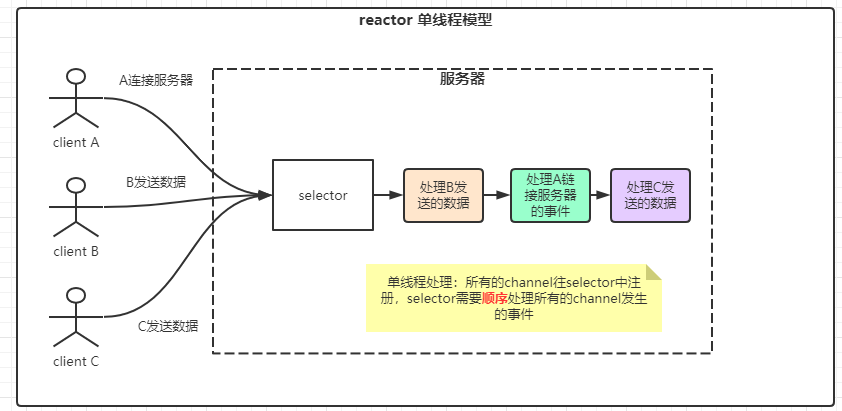
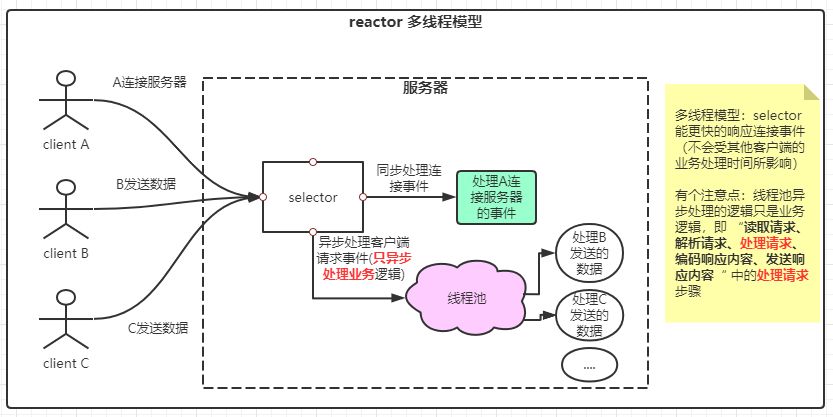

# 前言

* [上篇文章：IO系列学习总结三：三张图带你了解NIO通信程序的执行流程](https://blog.csdn.net/avengerEug/article/details/114176734)我们了解了一个普通NIO应用程序的通信执行流程。了解到了NIO的非阻塞具体体现在哪个地方。并对它的Selector、SelectedKey、Channel组件有了基础的了解。在上篇文章中的程序案例中，虽然它解决了BIO的阻塞问题，但它的吞吐量还不是特别高，因为它是单线程的。对于selector而言，它的工作太繁重了，需要管理服务端ServerSocketChannel的accept事件，还要管理连接到服务端的SocketChannel的read、write事件。大家可以仔细想一下：**假设在客户端A向服务端发送数据的同时，还有成千上万的客户端来连接客户端。那服务端的selector会不会因为先处理成千上万的客户端连接事件而导致延长了读取客户单A发来的信息时间呢？**这是肯定的，因为它就是单线程的，一个人单枪匹马的处理着ServerSocketChannel和SocketChannel的各种事件。
* 为了解决问题，[java并发之父：Doug Lea](https://baike.baidu.com/item/Doug%20Lea/6319404?fr=aladdin)基于AWT的事件原理提出了reactor模型，在他写的[Scalable IO in Java](http://gee.cs.oswego.edu/dl/cpjslides/nio.pdf)书中有提到reactor的三种线程模型：经典模型、多线程模型、多reactor模型（**关于这本书的剖析，可以在网上搜索相关的文档，在这里就不多阐述了**）。

## 一、每一个应用程序不可避免的五个步骤

* 不管是Web Service、分布式程序等等，大多数都有一个基础的流程：**读取请求、解析请求、处理请求、编码响应内容、发送响应内容**。

* 而最典型的服务模式如书中的下图所示：

  

客户端连接服务器，服务器开线程处理客户端的请求，处理过程包括上述的五个流程：**读取请求、解析请求、处理请求、编码响应内容、发送响应内容**。在这样的一个结构中，我们的线程处理请求需要经过五个步骤才能释放当前线程资源。

## 二、 reactor单线程模型

* 
* 由图中可以看出，每个客户端连接的都是服务端的一个selector。这个selector的任务非常繁重：需要处理**客户端连接服务端的事件，客户端向服务端发送数据事件、服务端向客户端回写数据事件**。在实际的应用中，`我们希望服务端能快速处理事件，而不希望因为客户端A的请求处理逻辑很长，导致客户端B的连接请求一直处于pending状态。`

## 三、reactor多线程模型

* 
* 由图中可以看出，多线程模型非常的简单，你不是要求服务端能快速处理事件？那行，客户端连接成功后，我直接开启一个线程来处理请求。主线程专门处理客户端的连接请求。这不就能快速处理事件了么？这种模型下，看似已经完美了，但是还是有一点瑕疵：**selector的工作太繁重了，又当爹又当妈。做的事比较杂，不专业，容易受到其他客户端产生事件的影响**。

## 四、reactor主从线程模型