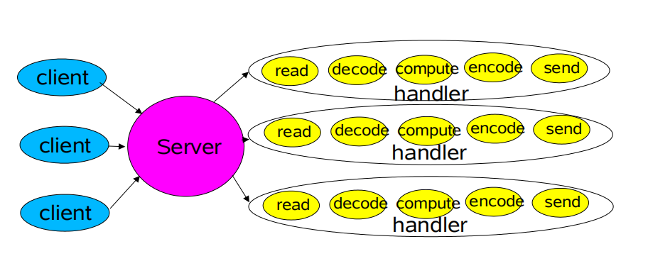

# 前言

* [上篇文章：IO系列学习总结三：三张图带你了解NIO通信程序的执行流程](https://blog.csdn.net/avengerEug/article/details/114176734)我们了解了一个普通NIO应用程序的通信执行流程。了解到了NIO的非阻塞具体体现在哪个地方。并对它的Selector、SelectedKey、Channel组件有了基础的了解。在上篇文章中的程序案例中，虽然它解决了BIO的阻塞问题，但它的吞吐量还不是特别高，因为它是单线程的。对于selector而言，它的工作太繁重了，需要管理服务端ServerSocketChannel的accept事件，还要管理连接到服务端的SocketChannel的read、write事件。大家可以仔细想一下：**假设在客户端A向服务端发送数据的同时，还有成千上万的客户端来连接客户端。那服务端的selector会不会因为先处理成千上万的客户端连接事件而导致延长了读取客户单A发来的信息时间呢？**这是肯定的，因为它就是单线程的，一个人单枪匹马的处理着ServerSocketChannel和SocketChannel的各种事件。
* 为了解决问题，[java并发之父：Doug Lea](https://baike.baidu.com/item/Doug%20Lea/6319404?fr=aladdin)提出了reactor模型，在他写的[Scalable IO in Java](http://gee.cs.oswego.edu/dl/cpjslides/nio.pdf)书中有提到reactor的三种线程模型：经典模型、多线程模型、多reactor模型。接下来我们来剖析这本书的内容。

## 一、所谓的网络应用程序

* 不管是Web Service、分布式程序等等，大多数都有一个基础的流程：**读取请求、解析请求、处理请求、编码响应内容、发送响应内容**。

* 而最典型的服务模式如书中的下图所示：

  

客户端连接服务器，服务器开线程处理客户端的请求，处理过程包括上述的五个流程：**读取请求、解析请求、处理请求、编码响应内容、发送响应内容**。在这样的一个结构中，我们的线程处理请求需要经过五个步骤才能释放当前线程资源。如果客户端的连接迅速增加，那服务器的压力就会变得非常大，要想解决这个问题，我们需要缩短**处理请求逻辑**的时间。此时我们有两个方向去解决：

> **1、降低服务器的压力**： 增加服务器的性能（CPU、内存、硬盘、带宽），或者增加服务器的数量来分担客户端的请求。
>
> **2、**采用**分治法**的思想，提高处理客户端请求的处理时间：将处理请求的逻辑拆分成各个子问题，由各个子问题来申请CPU的使用权，并行处理。