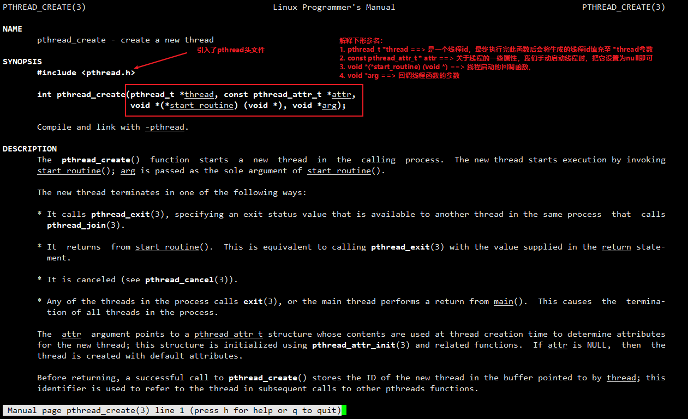
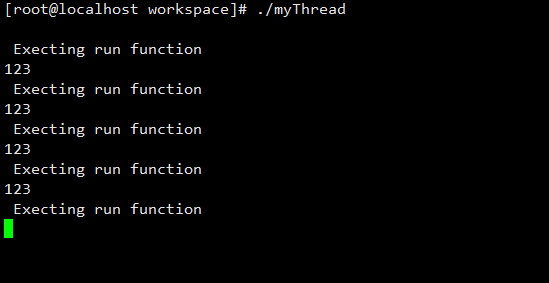
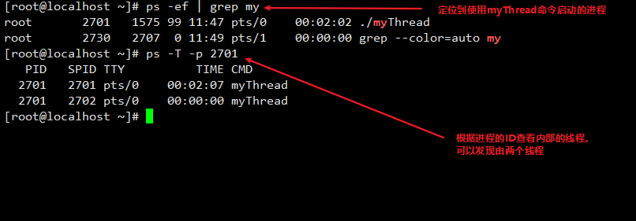
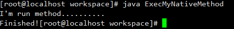
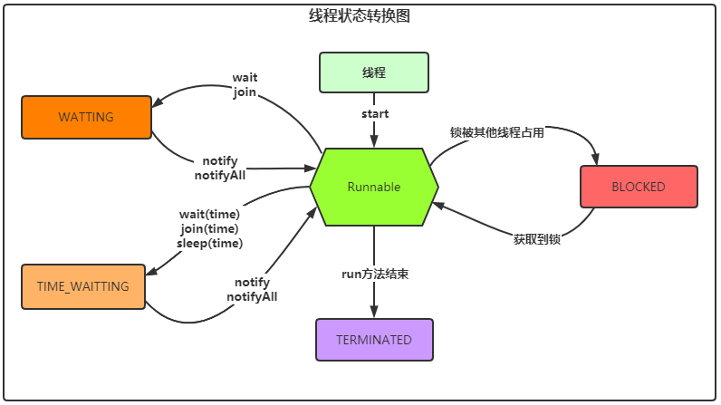

# java并发编程

## 一、java线程与操作系统(centos 7 64位，以下简称centos)的关系

### 1.1 centos os中创建线程的api

* 在centos中，要创建一个线程最终会调用到`pthread_create`方法。于是，我们执行如下命令来查看此方法内容

  ```shell
  #1. 安装man命令 => 为了查看函数信息
  yum install man-pages
  
  #2. 执行如下命令查看具体内容, 具体内容查看下图
  man pthread_create
  ```

  

### 1.2 使用os的api(pthread_create)创建一个线程

* 撰写myThread.c文件

  ```c
  #include "pthread.h" //头文件，在pthread_create方法中有明确写到
  #include "stdio.h"
  
  pthread_t pid; // 定义一个变量，用来存储生成的线程id, 在pthread_create方法中也有介绍
  
  /**
   * 定义主体函数
   */
  void* run(void* arg) {
      while(1) {
         printf("\n Execting run function \n");
         printf(arg);
         sleep(1);
      }
  }
  
  /**
   *  若要编译成可执行文件，则需要写main方法
   */
  int main() {
      pthread_create(&pid, NULL, run, "123"); // 调用os创建线程api
      while(1) { // 这里必须要写个死循环，因为c程序在main方法执行结束后，它内部开的子线程也会关掉
      }
  }
  ```

* 编译c文件成可执行命令

  ```shell
  # -pthread参数表示把pthread类库也添加到编译范围
  gcc -o myThread myThread.c -pthread
  ```

* 运行编译后的c文件

  ```shell
  ./myThread
  ```

* 执行结束后可以发现线程每隔1s就打印`Execting run function` 并输出123

  

  

  那我们要怎么去证明这个是**线程**还是**进程**呢？见下图

  

### 1.3 java中的线程和pthread_create有什么关系？

* 我们可以查看java中**Thread**类的`start`方法

  ```java
  public synchronized void start() {
      // ....... 省略前半部分
      boolean started = false;
      try {
          // *********调用了start0方法*******
          start0();
          started = true;
      } finally {
          // 省略finally中的代码块
      }
  }
  ```

* 我们继续查看`start0`方法

  ```java
  // 它仅仅是一个native修饰的方法，根据我们对jvm的了解，此方法是放在当前线程创建区域中的本地方法栈中
  // 所以它在jvm中肯定有对它的一个实现，但是它是怎么去交互的呢？ 我们目前不知道。。。
  // 按照这样的思路，咱们来创建一个自定义的native方法，然后用java程序去调用
  private native void start0();
  ```

### 1.4 使用java程序调用自己手写的native方法

* 第一步：创建`ExecMyNativeMethod.java`类(不用指定在哪个包下，因为最终要把它放在linux中去执行)

  ```java
  public class ExecMyNativeMethod {
  
      /**
       * 加载本地方法类库，注意这个名字，后面会用到
       */
      static {
          System.loadLibrary("MyNative");
      }
  
      public static void main(String[] args) {
          ExecMyNativeMethod execMyNativeMethod = new ExecMyNativeMethod();
          execMyNativeMethod.start0();
      }
  
      private native void start0();
  }
  ```

* 第二步：将java类编译成class文件

  ```shell
  javac ExecMyNativeMethod.java
  ```

* 第三步：将class文件转成c语言头文件

  ```shell
  javah ExecMyNativeMethod
  ```

* 第四步：我们来大致看一下java文件转成的c语言头文件内容

  ```c
  /* DO NOT EDIT THIS FILE - it is machine generated */
  #include <jni.h>
  /* Header for class ExecMyNativeMethod */
  
  #ifndef _Included_ExecMyNativeMethod
  #define _Included_ExecMyNativeMethod
  #ifdef __cplusplus
  extern "C" {
  #endif
  /*
   * Class:     ExecMyNativeMethod
   * Method:    start0
   * Signature: ()V
   */
  JNIEXPORT void JNICALL Java_ExecMyNativeMethod_start0
    (JNIEnv *, jobject);
  
  #ifdef __cplusplus
  }
  #endif
  #endif
  ```

  对于上述内容，我们只需要关注我们定义的native方法(`JNIEXPORT void JNICALL Java_ExecMyNativeMethod_start0
    (JNIEnv *, jobject);`)即可，也就是说native方法转成c语言头文件后会变成`JNIEXPORT void JNICALL Java_类名_native方法名 (JNIEnv *, jobject);`的格式

* 第五步：更新我们刚刚编写的`myThread.c`文件，为了不造成影响，我们使用cp命令创建出一个新的c文件**myThreadNew.c**

  ```shell
  cp myThread.c myThreadNew.c
  ```

  同时修改**myThreadNew.c**文件为如下内容

  ```c
  #include "pthread.h" // 引用线程的头文件，在pthread_create方法中有明确写到
  #include "stdio.h"
  #include "ExecMyNativeMethod.h" // 将自定义的头文件导入
  
  pthread_t pid; // 定义一个变量，用来存储生成的线程id, 在pthread_create方法中也有介绍
  
  /**
   * 定义主体函数
   */
  void* run(void* arg) {
      while(1) {
         printf("\n Execting run function \n");
         printf(arg);
         sleep(1);
      }
  }
  
  /**
   * 此方法就是后面java要调用到的native方法
   */
  JNIEXPORT void JNICALL Java_ExecMyNativeMethod_start0(JNIEnv *env, jobject c1) {
      pthread_create(&pid, NULL, run, "Creating thread from java application"); // 调用os创建线程api
      while(1) {} // 死循环等待
  }
  
  /**
   * 每个要执行的c文件都要写main方法，
   * 如果要编译成动态链接库，则不需要
   */
  int main() {
      return 0;
  }
  ```

* 第六步：执行如下命令将`myThreadNew.c`文件编译成**动态链接库**，并添加到环境变量中(否则在启动java类的main方法时，在静态代码块中找不到`myNative`类库)

  ```shell
  # 1. 编译成动态链接库
  # 说明下-I后面的参数: 分别指定jdk安装目录的include文件夹和include/linux文件夹
  # 因为我在环境变量中配置了JAVA_HOME，所以我直接世界$JAVA_HOME引用了
  # 后面的libMyNative.so文件，它的格式为lib{xxx}.so
  # 其中{xxx}为类中System.loadLibrary("yyyy")代码中yyyy的值
  gcc -I $JAVA_HOME/include -I $JAVA_HOME/include/linux -fPIC -shared -o libMyNative.so myThreadNew.c
  
  # 2. 将此动态链接库添加到环境变量中
  # 格式: export LD_LIBRARY_PATH=$LD_LIBRARY_PATH:{libxxxx.so}
  # 其中{libxxxxNative.so}为动态链接库的路径, 
  # 我的libMyNative.so文件在/root/workspace文件夹下
  export LD_LIBRARY_PATH=$LD_LIBRARY_PATH:/root/workspace/libMyNative.so
  ```

* 第七步：执行如下命令启动java程序

  ```shell
  java ExecMyNativeMethod
  ```

  运行结果：

  

  **完美！**我们成功的使用java应用程序调用了我们自定义的native方法。可是，我们在用java创建一个线程时，通常是要自己重写run方法，当我们启动线程时，调用的是start方法。刚刚我们证明了，native方法就是会调用到操作系统的一个c文件，如果要调用到run方法，那么我们就必须要通过c来调用到java中的方法。那我们接下来尝试着使用c文件来调用java代码

### 1.5 c语言文件调用java代码

* 第一步：优化我们的`ExecMyNativeMethod.java`类，新增run方法，具体如下：

  ```java
  package com.eugene.basic.thread.myNative;
  
  public class ExecMyNativeMethod {
  
      /**
       * 加载本地方法类库，注意这个名字，后面会用到
       */
      static {
          System.loadLibrary("MyNative");
      }
  
      public static void main(String[] args) {
          ExecMyNativeMethod execMyNativeMethod = new ExecMyNativeMethod();
          execMyNativeMethod.start0();
      }
  
      private native void start0();
  
      public void run() {
          System.out.println("I'm run method..........");
      }
  }
  ```

* 第二步：修改上述的`myThreadNew.c`文件为如下内容(用到了`JNI`，这个c文件在jdk的安装目录中可以找到，所以这是jdk提供的功能)：

  ```c
  #include "stdio.h"
  #include "ExecMyNativeMethod.h" // 将自定义的头文件导入
  #include "jni.h"
  
  /**
   * 此方法就是后面java要调用到的native方法
   */
  JNIEXPORT void JNICALL Java_ExecMyNativeMethod_start0(JNIEnv *env, jobject c1) {
  	jclass cls = (*env)->FindClass(env, "ExecMyNativeMethod");
      if (cls == NULL) {
          printf("Not found class!");
          return;
      }
      
      jmethodID cid = (*env)->GetMethodID(env, cls, "<init>", "()V");
      if (cid == NULL) {
          printf("Not found constructor!");
          return;
      }
      
      jobject obj = (*env)->NewObject(env, cls, cid);
      if (obj == NULL) {
          printf("Init object failed!");
          return;
  	}
      
      jmethodID rid = (*env)->GetMethodID(env, cls, "run", "()V");
      jint ret = (*env)->CallIntMethod(env, obj, rid, NULL);
  	
      printf("Finished!");
  }
  ```

* 第三步：将`myThreadNew.c`文件编译成`动态链接库`

  ```shell
  gcc -I $JAVA_HOME/include -I $JAVA_HOME/include/linux -fPIC -shared -o libMyNative.so myThreadNew.c
  ```

* 第四步：编译java类并执行它

  ```java
  javac ExecMyNativeMethod.java
  java ExecMyNativeMethod
  ```

* 运行结果：

  

  **牛逼！**


## 二、线程基础

### 2.1 java之Synchronized关键字的几种用法即特点

#### 2.1.1 锁类实例和类对象

* 具体参考如下代码：

  ```java
  // 情况一：锁object对象
  public class Demo {
  
      private Object object = new Object();
  
      public void test(){
          synchronized (object) {
              System.out.println(Thread.currentThread().getName());
          }
      }
  }
  
  // 情况二: 锁当前对象 this，锁定某个代码块
  // 使用此种方式要注意调用进来的this是否为同一对象
  // 若Demo的实例不是单例的，那么这把锁基本上起不到同步的作用
  public class Demo {
  
      public void test() {
          //synchronized(this)锁定的是当前类的实例,这里锁定的是Demo2类的实例
          synchronized (this) {
              System.out.println(Thread.currentThread().getName());
          }
      }
  }
  
  // 情况三: 锁当前对象 this，锁定整个方法
  // 与情况二类似，但是它是锁住了整个方法，粒度比情况二大
  public class Demo {
  
      public synchronized void test() {
          System.out.println(Thread.currentThread().getName());
      }
  }
  
  
  // 情况四: 锁类对象，粒度最大，
  // ===> 当调用当前类的所有同步静态方法将会等待获取锁
  // 注意: 但是此时还是能调用类实例的同步方法。为什么呢？
  // 因为静态同步方法和类实例同步方法拥有的锁不一样
  // 一个是类对象一个是类实例对象。
  // 同时，此时还能调用类对象的静态非同步方法以及类实例的
  // 非同步方法。为什么呢？因为这些方法没有加锁啊，可以直接调用。
  
  public class Demo {
  
      public static synchronized void test() {
          System.out.println(Thread.currentThread().getName());
      }
  }
  ```

#### 2.1.2 锁同一个String常量

* 查看如下代码：

  ```java
  /**
    上面说了，synchronized关键字锁的是对象，
    而对于s1和s2这两个对象，他们的值都是lock，
    也就是放在常量池中的(堆内的方法区)，
    所以s1和s2指向的是同一个对象。所以
    下面的test1和test2方法使用的都是同一把锁，
    最终的运行结果就是线程2会等待线程1把锁释放完毕后
    才能获取锁并执行如下代码。
   */
  public class Demo {
  
      String s1 = "lock";
      String s2 = "lock";
  
      public void test1() {
          synchronized (s1) {
              System.out.println("t1 start...");
              try {
                  TimeUnit.SECONDS.sleep(2);
              } catch (InterruptedException e) {
                  e.printStackTrace();
              }
              System.out.println("t1 end...");
          }
      }
  
      public void test2() {
          synchronized (s2) {
              System.out.println("t2 start...");
          }
      }
  
      public static void main(String[] args) {
          Demo demo = new Demo();
          new Thread(demo :: test1, "test1").start();
          new Thread(demo :: test2, "test2").start();
      }
  
  }
  ```

#### 2.1.3 拥有线程安全的一段代码

* 代码如下：

  ```java
  /**
   多个线程同时对count进行减减操作，
   会出现线程安全的问题(运行的结果不一定，因为所有的线程会由cpu的调度来决定)，
   假设线程1对count减减了，但是此时还没有进行输出，线程2和线程3都对count进行
   了减减操作，此时线程1的打印数据中，count就会变成7，
   为了解决这个问题，可以使用synchronized关键字加锁。
   
   这里还要注意，此段代码在执行的过程中，每个线程都会将count拷贝到它自己的工作
   内存中去，所以他们操作的都是自己内存中的值，在这期间有可能线程修改完状态后
   就去通知了主内存，让他同步一下修改后的值，同时主内存会通知其他的线程，让他们
   读取这个变量时，从主内存中去读。 这里要注意，上面说的是 "有可能线程修改完状态后
   就去通知了主内存"。这个是不确定的，如果一定要保证这样的一个逻辑的话，
   可以对方法添加synchronized关键字，此关键字可以保证安全以及将上面的有可能去掉，
   最终就一定会是：线程修改完状态后就去通知主内存。所以synchronized关键字
   也具有"可见性"(可见性后面会说)
   */
  public class Demo implements Runnable {
  
      private int count = 10;
  
      @Override
      public /*synchronized*/ void run() {
          count--;
          System.out.println(Thread.currentThread().getName() + " count = " + count);
      }
  
      public static void main(String[] args) {
          Demo demo = new Demo();
          for (int i = 0; i < 5; i++) {
              new Thread(demo, "thread-" + i).start();
          }
      }
  
  }
  ```

#### 2.1.4  可重入性(包括继承)

* 概念解释：**所谓可重入性就是在有锁的方法内调用另一个加锁的方法**

* 见如下代码

  ```java
  /**
   一个同步方法调用另外一个同步方法，支持可重入
   */
  public class Demo {
  
      public synchronized void test1() {
          System.out.println("test1 start.........");
          try {
              TimeUnit.SECONDS.sleep(1);
          } catch (InterruptedException e) {
              e.printStackTrace();
          }
          test2();
      }
  
      public synchronized void test2() {
          System.out.println("test2 start.......");
      }
  
      public static void main(String[] args) {
          Demo demo = new Demo();
          demo.test1();
      }
  
  }
  
  /**
   继承也支持可重入特性
   */
  public class Demo {
  
      synchronized void test() {
          System.out.println("demo1 test start........");
          try {
              TimeUnit.SECONDS.sleep(1);
          } catch (InterruptedException e) {
              e.printStackTrace();
          }
          System.out.println("demo1 test end........");
      }
  
      public static void main(String[] args) {
          new Demo2().test();
      }
  
  }
  
  class Demo2 extends Demo {
  
      @Override
      synchronized void test() {
          System.out.println("demo2 test start........");
          // 此处调用了父类的方法
          super.test();
          System.out.println("demo2 test end........");
      }
  
  }
  ```

#### 2.1.5 Synchronized释放锁的几种情况

* Synchronized关键字是**手动上锁自动释放锁**的。同时自动释放锁包括：`加锁代码块执行结束或者抛出的异常`
* 同时，在执行await方法时，锁会被自动释放。

#### 2.1.6 特点总结

* 具有可重入性、可见性、原子性。


### 2.2 API之wait/notify/notifyAll

* wait、notify、notifyAll要和锁一起搭配使用，同时notify的作用是唤醒某个阻塞中的线程，这个线程是随机的，由cpu的调度决定

#### 2.2.1 使用wait、notify实现一个生产者一个消费者问题

* 使用wait和notify实现一个消息队列，生产者1秒生产一个消息,当队列的元素达到10个时，生产者停止生产，通知消费者消费消息

  ```java
  public class Index1 {
  
      private LinkedList<Message> linkedList = new LinkedList<>();
  
      private static Object lock = new Object();
  
      public static void main(String[] args) {
          Index1 index1 = new Index1();
  
          new Thread(() -> {
  
              while (true) {
                  synchronized (lock) {
                      if (index1.linkedList.size() <= 0) {
                          try {
                              // 通知生产者继续生产
                              lock.notify();
                              // 这里有个知识点：
                              // 当调用lock的wait方法时，当前线程会
                              // 释放lock这把锁
                              lock.wait();
  
                          } catch (InterruptedException e) {
                              e.printStackTrace();
                          }
                      }
  
                      Message message = index1.linkedList.pollLast();
                      System.out.println("消费消息： " + message.content);
                  }
              }
  
          }, "消费者").start();
  
  
          new Thread(() -> {
              while (true) {
                  synchronized (lock) {
                      if (index1.linkedList.size() == 10) {
                          try {
                              System.out.println("生产者生产消息达到10条，开始通知消费者消费");
                              lock.notify();
  
                              // 自己等待，释放这把锁让消费者拥有锁，停止自己的生产
                              lock.wait();
                          } catch (InterruptedException e) {
                              e.printStackTrace();
                          }
                      }
  
                      try {
                          TimeUnit.SECONDS.sleep(1);
                      } catch (InterruptedException e) {
                          e.printStackTrace();
                      }
  
                      Message message = new Message(UUID.randomUUID().toString());
                      index1.linkedList.addFirst(message);
                      System.out.println("生产者生产消息： " + message.content);
                  }
  
              }
          }, "生产者").start();
      }
  }
  
  class Message {
      String content;
  
      public Message(String context) {
          this.content = context;
      }
  }
  ```

#### 2.2.2 使用wait和notifyAll实现生产者和消费者问题

* 2个生产者消费消息，5个消费者抢消息进行消费

  ```java
  // 2个生产者消费消息，5个消费者抢消息进行消费
  public class Index2 {
  
      private static LinkedList<Message> linkedList = new LinkedList<>();
  
      private static Object consumerLock = new Object();
  
      private static Object producerLock = new Object();
  
      public static void main(String[] args) {
          for (int i = 0; i < 5; i++) {
              new Thread(() -> {
                  while (true) {
                      synchronized (consumerLock) {
                          if (linkedList.size() <= 0) {
                              continue;
                          }
  
                          Message first = linkedList.pollLast();
                          System.out.println(Thread.currentThread().getName() + "消费消息" + first.content);
                      }
                  }
              }, "消费者-" + i).start();
          }
  
          for (int i = 0; i < 2; i++) {
              new Thread(() -> {
                  while (true) {
                      synchronized (producerLock) {
                          producerLock.notify();
                          try {
                              TimeUnit.SECONDS.sleep(1);
                          } catch (InterruptedException e) {
                              e.printStackTrace();
                          }
                          Message message = new Message(UUID.randomUUID().toString());
                          linkedList.addFirst(message);
                          System.out.println(Thread.currentThread().getName() + "生产消息" + message.content);
                          try {
                              producerLock.wait();
                          } catch (InterruptedException e) {
                              e.printStackTrace();
                          }
                      }
                  }
              }, "生产者-" + i).start();
          }
      }
  }
  ```

#### 2.2.3 写一个同步容器,支持两个生产者线程以及10个消费者线程的阻塞调用

* 写一个同步容器，拥有Put和get方法，以及getCount方法，能够支持两个生产者线程以及10个消费者线程的阻塞调用

  ---> 阻塞调用的含义：当消费者调用get方法时，若里面没有值则阻塞在那里，直到有值后再获取

* **使用jdk自带的wait和notify方式实现**

  ```java
  public class Container<T> {
  
      private LinkedList<T> linkedList = new LinkedList<>();
  
      public synchronized void put(T t) {
          this.notifyAll();
          linkedList.addFirst(t);
      }
  
      /**
       * get这里会出现阻塞调用的情况，
       * 如果长度为0时，则等待生产者往里面生成东西
       * @return
       */
      public synchronized T get() {
          while (this.getCount() == 0) {
              try {
                  System.out.println(Thread.currentThread().getName() + "调用get方法时，无消息可拿取，等待中…………");
                  this.wait();
              } catch (InterruptedException e) {
                  e.printStackTrace();
              }
          }
          return linkedList.pollFirst();
      }
  
      public synchronized int getCount() {
          return linkedList.size();
      }
  
  
      public static void main(String[] args) {
          Container<String> container = new Container<>();
  
          for (int i = 0; i < 2; i++) {
              new Thread(() -> {
                  String val = UUID.randomUUID().toString();
                  container.put(val);
                  System.out.println(Thread.currentThread().getName() + "生产消息：" + val);
              }, "生产者-" + i).start();
          }
  
          for (int i = 0; i < 10; i++) {
              new Thread(() -> {
                  String val = container.get();
  
                  System.out.println(Thread.currentThread().getName() + "消费消息：" + val);
              }, "消费者-" + i).start();
          }
      }
  
  }
  ```

* **使用ReentryLock的Condition实现**

  ```java
  // 代码 TODO
  ```

### 2.3 创建线程的几种方式

* 详见如下表格：

  |     方式类别     |                             特点                             |
  | :--------------: | :----------------------------------------------------------: |
  |   继承Thread类   |              java是单继承的，一般不推荐此种方式              |
  | 实现Runnable接口 |            java支持实现多个接口，一般使用此种方式            |
  | 使用FutureTask类 | 与Runnable的实现方式差不多，都要将对应的实例传入Thread对象中去，但它能获取到线程执行结果的返回值 |

### 2.4 线程的几个常用api汇总

* 详见如下表格：

  |      api      |                             特点                             |                             备注                             |
  | :-----------: | :----------------------------------------------------------: | :----------------------------------------------------------: |
  |     stop      | 暴力停止线程，jvm不推荐此种方式，而且此api将在后面的jdk中被抛弃。 |                              无                              |
  |     yield     |                   当前线程让出cpu的使用权                    |      此方法为Thread的类方法，底层调用了原生的yield方法       |
  |   interrupt   | 停止线程的优雅方式，jvm认为就算要停止线程也应该要执行线程停止后的业务逻辑，比如关闭某些连接资源。此方式只是标识了线程的状态为interrupt | 实例方法。`若线程处于sleep状态，抛出InterruptedException后，又会将interrupt状态给置为false` |
  | isInterrupted |               判断当前线程是否为interrupt状态                |                           实例方法                           |
  |  interrupted  |     判断当前线程是否为interrupt状态，并清除interrupt状态     |                            类方法                            |
  |     sleep     |   将当前线程睡眠一段时间，此方法会抛出InterruptedException   |                            类方法                            |
  |     wait      | 此方法为object类的方法，一般作用于锁对象上，也就是说假设有一个锁为Object lock = new Object(); 那么一般是调用lock.wait(); 此方法可以让当前线程处于阻塞状态 |                              无                              |
  |    notify     | 与wait成对出现，一般也是使用锁对象的notify方法，因为这样才能具体的通知到使用同一个锁对象的wait方法而进入阻塞状态的线程。 |   notify具有唤醒一个线程的功能，具体唤醒哪个线程由cpu决定    |
  |   notifyAll   |                 与wait成对出现，与notify类似                 |            notifyAll唤醒的是所有wait状态下的线程             |
  |    suspend    |                           暂停线程                           |                          不会释放锁                          |
  |    resume     |                 恢复线程，与suspend配套使用                  |                              无                              |
  |     join      | 优先执行指定线程，eg：在线程t2中调用线程t1.join()方法，那么t2会让出cpu的调度权，让t1先执行 |                              无                              |

### 2.3 线程状态转换图

* 

### 2.4 如何优雅的终止一个线程

* 首先咱们要理解线程处于阻塞状态的情况，在这里只考虑如下两种情况

  ```java
  /**
    情况一：
      run方法内部执行逻辑是使用while + 一个布尔变量来控制逻辑的
      此种方法，我们可以通过修改flag变量来达到终止线程的目的。
      但是这种情况有一种缺陷，就是假如我在循环体内睡眠了10s，然后
      主线程在3s的时候把flag设置为false了。当我们把flag设置为false时，
      其实是想让线程立马终止的，但是按照这样的一个逻辑的话，它并不会立马
      终止，反而会再睡眠7s钟后执行后面的System.out.println("runing");
      代码。
      
      所以我们直接使用flag的方式达不到立即终止线程的阻塞状态
    */
  static flag = true;
  public static void main(String[] args) {
      MyThread t = new MyThread();
      t.start();
  }
  
  private static class MyThread extends Thread {
      public void run() {
          while(flag) {
              try {
                  Thread.sleep(10000);
              } catch (InterruptedException e) {
                  e.printStackTrace();
              }
              System.out.println("runing");   
          }
      }
  }
  
  /**
    情况二：
      我们的目的是直接让线程停止，那我们直接调用它的stop方法不就行了吗？
      如下述main方法所述。
  	
  	emmm, 我想说这样的确能达到目的，但是jvm不推荐这么停止一个线程，
  	而且stop方法在后续的jdk版本中可能会被抛弃。为什么不推荐呢？
  	我们假设这么一个场景，我们要不停的读取一个文件，所以要在while
  	循环体中打开一个文件流，假设还未执行到关闭流的代码部分，主线程
  	就调用到了stop方法，那这不就造成资源浪费了嘛
   */
  public static void main(String[] args) {
  	t.stop();
  }
  ```

  总而言之：**jvm不希望直接停止一个线程，而是希望线程要执行结束。**那么我们要如何解决上述的情况二呢？我们可以使用`interrupt()`方法，假设一个线程执行此方法时，它会抛出`InterruptedException`异常(实际上是将线程标识成了**interrupt**状态，此时如果线程在执行过程中，发现它是处于**interrupt**状态，于是抛出了`InterruptedException`异常)，此时我们可以截取到这个异常然后执行一些`关闭资源`类似的操作

  