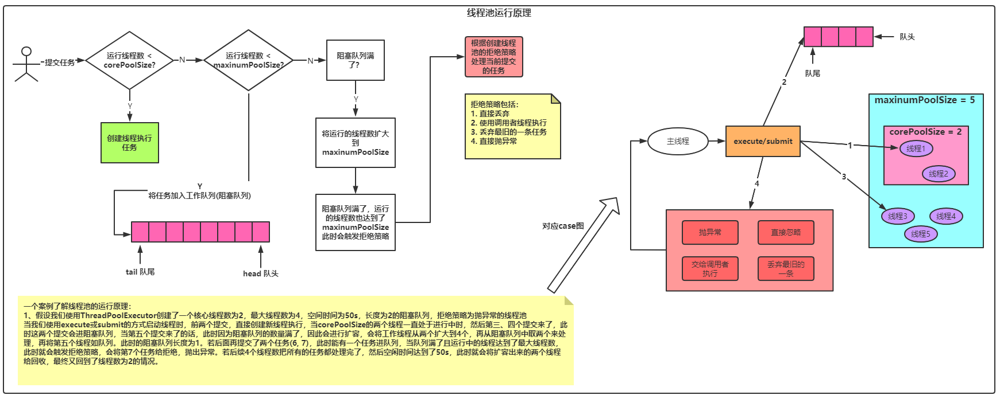

## 使用线程池的目的
  1. 减少系统维护线程的开销，因为每次开启线程、销毁线程都要调用到native方法，最终就是与os进行交互，十分耗性能
  2. 解耦(把运行和创建分开)
  3. 线程复用

## 线程池几大核心参数
    1. corePoolSize：核心线程数大小，若当前运行中的线程数量小于这个数量，那么新任务提交时，直接创建新线程来执行任务
    2. maxinumPoolSize：最大线程数，若当前运行中的线程 > 核心线程数，那么在提交任务时，创建出来的线程是放在工作队列中
    3. keepAlivedTime：存活时间，线程闲置时间超过了这个值，则会将它回收
    4. unit：存活时间的时间单位
    5. workQueue：工作队列，当运行中的线程大于的核心线程数，那么新提交的任务就会把它放在工作队列中去
    6. threadFactory：指定创建线程的工厂，一般使用默认的工厂方法**Executors.defaultThreadFactory()**
    7. rejectedHandler：拒绝策略，当线程池中线程的数量达到了最大线程数，此时新提交的任务就会被拒绝，拒绝策略有四种：**直接忽略、调用者来处理任务、抛弃掉最久的任务、直接抛异常**

## 线程池工作原理

