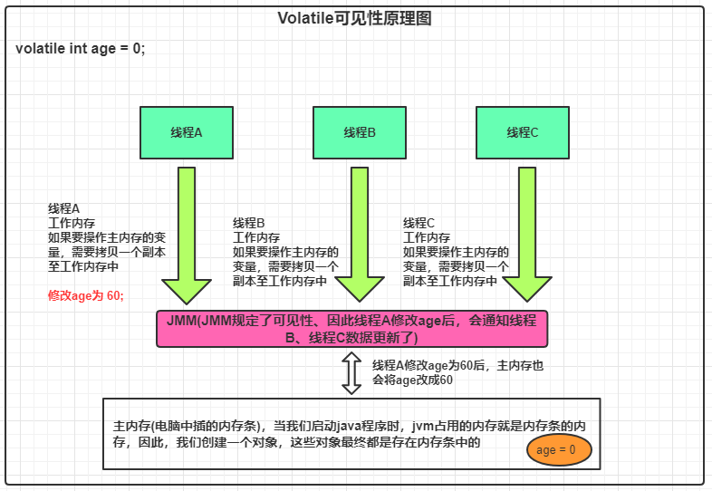

## Volatile相关总结

### 一、什么是volatile

* volatile是jvm提供的一种轻量级的同步机制

* 三大特性：

  ```txt
  1、可见性
  2、不保证原子性
  3、禁止指令重排
  ```

### 二、JMM(Java 内存模型)

* 要了解volatile之前，就要了解JMM。java内存模型是一种抽象的概念，实际并真实存在。它描述的一种规则或规范。通过这种规范定义了程序中各个变量(实例字段、静态字段和构成数组对象的形式)的访问方式。JMM的具体规范为：

  ```txt
  jvm在创建一个线程时都会为它创建一个工作内存(每个线程私有的线程区域)，而jmm中规定所有的变量都存储在主内存(主内
  存是所有线程共享的，就是插在电脑上的内存条)。但线程对主内存变量操作必须在工作内存中进行，因此在读变量时，若自
  己的工作内存中无变量，此时需要将主内存变量拷贝至工作内存(每个线程的工作内存中操作的都是主内存变量的副本)，当线
  程要对变量进行修改时，此时会添加一把锁，表示我要修改主内存的共享变量，其他线程要操作这个变量需要等一会，待修改
  完毕后，线程会释放同一把锁，并且主内存会通知所有的工作内存进行数据同步。
  
  具体的规范是参考了cpu的mesi规范，在硬件层面，因为cpu的运算速度超级快，比内存还快，由于内存的处理速度有限，
  为了保证cpu的性能不受内存影响，因此cpu和主内存之间还有三层高速缓存，分别为l1, l2, l3缓存，有了这三层高速缓
  存，但最终还是要将数据同步至缓存中，因此这个协议叫做mesi协议。
  ```

* JMM关于同步的规定：

  ```txt
  1、线程解锁前，必须把共享变量的值刷新回主内存
  2、线程加锁前，必须读取内存的最新值到自己的工作内存
  3、加锁解锁是同一把锁
  ```

* JMM的特性：

  ```txt
  1、可见性
  2、原子性
  3、有序性(禁止指令重排)
  ```

### 三、可见性

* 参考下图理解

  

* 总结：volatile的可见性是和jmm的可见性对应的，参考了硬件层面的mesi协议。大致的实现原理就是，线程的工作区

  间对主内存的副本变量进行修改后，要通知其他线程工作区间的变量进行更新，保证可见性。

* 代码证明:

  ```java
  public class View {
  
      public static void main(String[] args) throws InterruptedException {
          Person person = new Person();
          Thread threadA = new Thread(() -> {
              System.out.println("线程A 3s后修改age....");
              try {
                  Thread.sleep(3000);
                  person.age = 18;
              } catch (InterruptedException e) {
                  e.printStackTrace();
              }
              System.out.println("线程A 修改完成： " + person.age);
          }, "线程A");
          System.out.println("主线程等待线程A执行完~~~");
          threadA.start();
          while (person.age == 0) {
  
          }
          System.out.println("主线程： " + person.age);
  
      }
  }
  
  /**
   * 没有加volatile修饰age的话，程序处于死循环
   * 加了volatile后，程序能正常关闭
   */
  class Person {
      /*volatile*/ int age = 0;
      public void addAge(int val) {
          this.age += val;
      }
  }
  ```

  PS: 其实我认为这应该是**指令重排**，因为这遵循了happens before的使用在定义之前，while(person.age == 0)这段代码，jvm在编译期间发现在上方有对person.age变量修改过，所以不进行指令重排优化。

### 四、不保证原子性

* 代码证明：

  ```java
  public class View {
  
      public static void main(String[] args) throws InterruptedException {
          noAtomic();
      }
  
      private static void noAtomic() {
          Person person = new Person();
          for (int i = 0; i < 20; i++) {
              new Thread(() -> {
                  for (int i1 = 0; i1 < 1000; i1++) {
                      person.agePlusPlus();
                  }
              }).start();
          }
  
          /**
           * 一个java程序启动后，至少有两个线程，一个是主线程另外一个是垃圾回收线程
           */
          while (Thread.activeCount() > 2) {
              Thread.yield();
          }
  
          System.out.println("20个线程对person age变量加加20000次后的结果：" + person.age);
      }
      
      class Person {
          /*volatile*/ int age = 0;
          public void addAge(int val) {
              this.age += val;
          }
  
          public void agePlusPlus() {
              age++;
          }
  	}
  }
  ```

* volatile不保证原子性的原因：

  ```txt
  由于volatile在底层有一个刷新主内存的机制，由于这个刷新主内存的这个操作不是原子性的，因此会出现多个线程运行时
  序错乱问题，进而导致线程不安全，最终不能导致原子性。而且在jvm中，对++操作进行jvm指令编译时，会将++操作编译
  成三个操作，分别是读取变量、加一操作、回写操作。因为volatile不保证原子性，因此最终的结果肯定会造成线程不安全
  的情况
  ```

* 解决volatile不能保证原子性

  ```txt
  1、加synchronize关键字 ----- 力度比较大，杀鸡用牛刀
  2、CAS保证，使用juc包下的Automic相关的类 --- 底层使用unsafe类来操作cpu，保证一个cpu指令只有一个线程执行
  ```

### 五、禁止指令重排

* 由于JMM定义了有序性，因此会做一些汇编优化，做指令重排，设计到底层汇编。

  ```txt
  计算机在执行程序时，为了提高性能，编译器和处理器常常会对指令进行重排，一般分为如下三种：
  1、编译器优化的重排
  2、指令并行的重排
  3、内存系统的重排
  ```

  举个最常见的例子：我们在高考前，老师们都会对同学们说：卷子发下来时，一定要先扫一遍题目，先把会做的题目

  给做了，不会做的、难得留在最后面。 

  在这个例子中，很明显，我们的做题的顺序与试卷中的题目顺序是不一样的。

  在计算机层面的指令重排期间，必须要在`数据依赖性`的前提下再进行指令重排。

  因为计算机的指令重排的特性我们无法保证，因此我们可以添加volatile关键字修饰一些变量，来防止指令重排。底层

  的话volatile是利用了cpu的一个叫**Memory Barrier**的指令，cpu在见到这个指令时，不会针对这条指令做重排操作。

### 六、volatile禁止指令重排保证单例模式的安全性

```java

```


