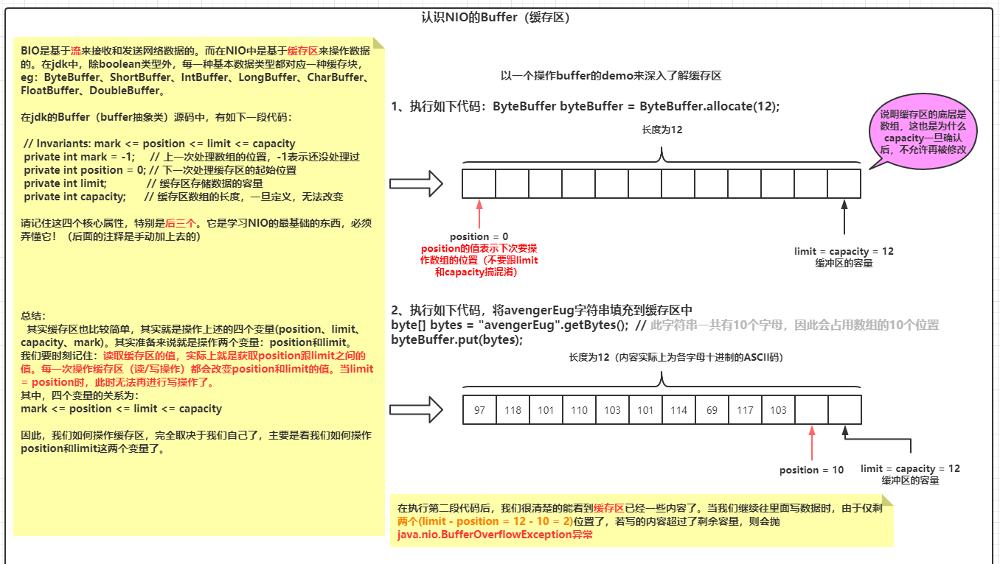
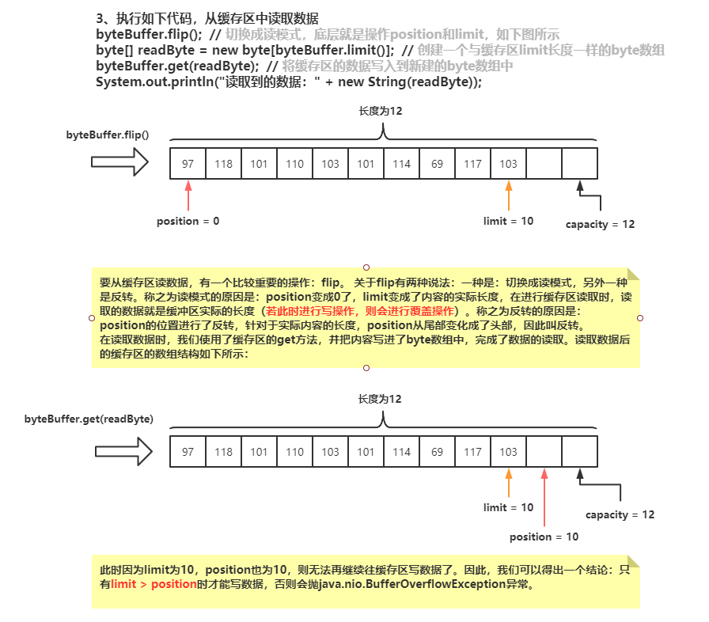
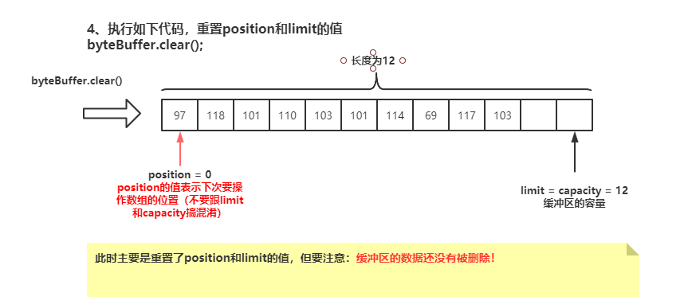

## 基于nio实现群聊天室 --- 多个人在同一个聊天室中聊天


### 一、目前实现的功能
* 支持多人聊天

### 二、常见api

#### 2.1 buffer系列

##### 2.1.1 认识byte buffer

* ByteBuffer是nio中的一个缓存块（就是一个数组），用来存储数据的，其有四个属性

  ```txt
  limit: 限制整个buffer的容量大小  ---> limit有多大，表示byteBuffer中的数据内容有多大
  position: 表示缓冲区正在操作数据的位置
  capacity: byteBuffer缓存块数组的长度
  mark: 备忘位置：表示缓冲区正在操作数据的上一个位置
  ```

  通过get和put api来对byteBuffer的数据进行读取和填充。

* 通过一个案例了解byteBuffer的前三个属性

  

  

  

##### 2.1.2 put & get

* put和get方法是对缓存区的读和写操作。当我们定义为字节类型的缓存区时，我们也可以写除boolean类型以外的基础数据类型，且获取时要保证顺序获取，否则会出现数据错乱的情况。测试用例如下：

  ```java
  public static void main(String[] args) {
      ByteBuffer byteBuffer = ByteBuffer.allocate(1024);
  
      System.out.println("put值");
      // 默认put进去的就是byte  占用缓存区的1个字节位置
      byteBuffer.put(new Byte("97"));
      // 占用缓存区的2个字节位置
      byteBuffer.putShort((short) 10);
      // 占用缓存区的4个字节的位置
      byteBuffer.putInt(922);
      // 占用缓存区的8个字节的位置
      byteBuffer.putLong(108L);
      // 占用缓存区的4个字节的位置
      byteBuffer.putFloat(1.7F);
      // 占用缓存区的8个字节的位置
      byteBuffer.putDouble(2.2);
      // 占用缓存区的2个字节的位置
      byteBuffer.putChar((char) 97);
  
      System.out.println("---------------------------------------");
      System.out.println("执行到这里，一共会占用缓存区的29个字节, 因此limit为1024，potision为29，capacity为1024");
      System.out.println("limit => " + byteBuffer.limit());
      System.out.println("capacity => " + byteBuffer.capacity());
      System.out.println("position => " + byteBuffer.position());
  
      System.out.println("---------------------------------------");
      byteBuffer.flip();
      System.out.println("get值  ==> 比较重要：一定要按顺序读，否则读取出来的数据自己都不认识！");
      System.out.println(byteBuffer.get());
      System.out.println(byteBuffer.getShort());
      System.out.println(byteBuffer.getInt());
      System.out.println(byteBuffer.getLong());
      System.out.println(byteBuffer.getFloat());
      System.out.println(byteBuffer.getDouble());
      System.out.println(byteBuffer.getChar());
  
  }
  ```

##### 2.1.3 clear和flip的区别

* clear源码：

  ```java
  public final Buffer clear() {
      position = 0;
      limit = capacity;
      mark = -1;
      return this;
  }
  ```

* flip源码：

  ```java
  public final Buffer flip() {
      limit = position;
      position = 0;
      mark = -1;
      return this;
  }
  ```

  可以看到区别就在于：limit的赋值
  在clear中，limit的值变成了capacity的值  --> limit变成capacity的值，若强行读取，可能会读取出空数据
  在flip中，limit的值变成了position的值   --> 实际上可以读取数据的长度。

  假设当前的limit = position = capacity  调用clear或flip所达到的效果是一样的
  假设当前的limit > position,   调用clear和flip的区别只有在读取操作时才有所体现，
  在clear后去读取数据，此时读取出来的数据包含空数据(limit 到 capacity的数据都会读取到)，
  在flip后去读取数据，此时读取的数据是真实的数据长度

##### 2.1.4 AsReadOnlyBuffer

* copy出来一个只读的缓存区，其类型为：**HeapByteBufferR**，其内部所有关于写操作的函数都是抛异常。测试用例如下：

  ```java
  public static void main(String[] args) {
      ByteBuffer byteBuffer = ByteBuffer.allocate(10);
  
      // 获取到的类型为：HeapByteBufferR  => 看源码可知：所有关于写的方法全部是抛异常
      ByteBuffer readOnlyByteBuffer = byteBuffer.asReadOnlyBuffer();
      // 尝试写内容  -->  直接抛异常：Exception in thread "main" java.nio.ReadOnlyBufferException
      readOnlyByteBuffer.put((byte) 97);
  }
  ```

##### 2.1.5 Slice

* 拷贝一个缓存区出来，与原缓存区一模一样，但修改拷贝后的缓存区的数据时，原缓存区的数据也会被修改。测试用例如下：

  ```java
  public static void main(String[] args) {
      // 创建长度为1的缓存区
      ByteBuffer byteBuffer = ByteBuffer.allocate(7);
      // 往缓存区放一个小写的a字母
      byteBuffer.put((byte) 97);
      byteBuffer.flip();
      System.out.println("缓存区的数据为：");
      System.out.println((char) byteBuffer.get());
      // 还原position的值
      byteBuffer.clear();
  
      /**
           * 使用slice方法创建出来新的缓存区，此缓存区与原缓存区一模一样
           */
      ByteBuffer byteBufferCopy = byteBuffer.slice();
      // 当我们修改复制出来的缓存区的数据时，原缓存区的数据也会被修改
      byteBufferCopy.put((byte) 98);
      System.out.println("修改拷贝的缓存区的数据后，原缓存区的数据为：");
      System.out.println((char) byteBuffer.get());
  
  }
  ```

##### 2.1.6 Wrap

* 传入一个数组来构建缓存区，当修改数组内容时，缓存区的内容也会被修改。测试用例如下：

  ```java
  public static void main(String[] args) {
      // 初始值：a, b, c
      byte[] bytes = new byte[]{(byte) 97, (byte) 98, (byte) 99};
  
      ByteBuffer byteBuffer = ByteBuffer.wrap(bytes);
      // 修改bytes数组中的值 ===> 改成  n
      bytes[2] = (byte) 110;
  
      System.out.println("修改数组后的值：byteBuffer的值也发生了变化");
      while (byteBuffer.remaining() > 0) {
          System.out.println((char) byteBuffer.get());
      }
  }
  ```

##### 2.1.7 allocateDirect

* 创建出一个堆外内存的缓存区，此缓存区类型为**DirectByteBuffer**，存在于操作系统的内存中，jvm中只保存了一个地址，指向堆外内存。而heapByteBuffer则是基于堆内内存的，byte数组保存在jvm中，当要进行网络交互时，需要把堆内内存 拷贝 一份到操作系统中，然后操作系统再基于这个内存进行网络传输。测试用例如下：

  ```java
  public static void main(String[] args) {
      ByteBuffer byteBuffer = ByteBuffer.allocateDirect(10);
  
      byteBuffer.put((byte) 97);
      byteBuffer.flip();
      while (byteBuffer.remaining() > 0) {
          System.out.println(((char) byteBuffer.get()));
      }
  }
  ```

  

