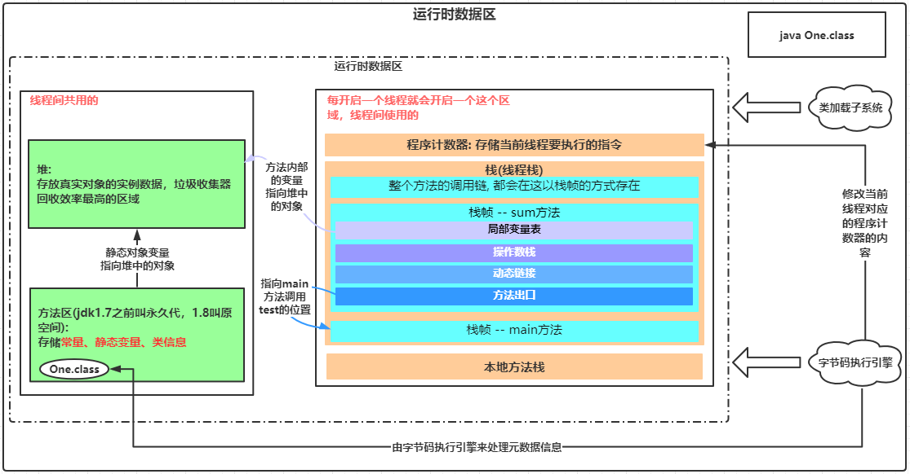
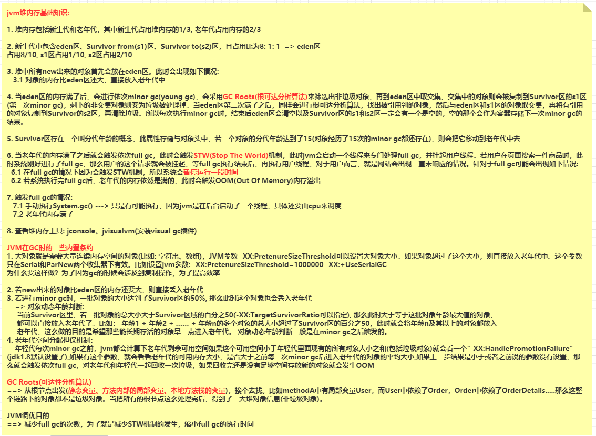
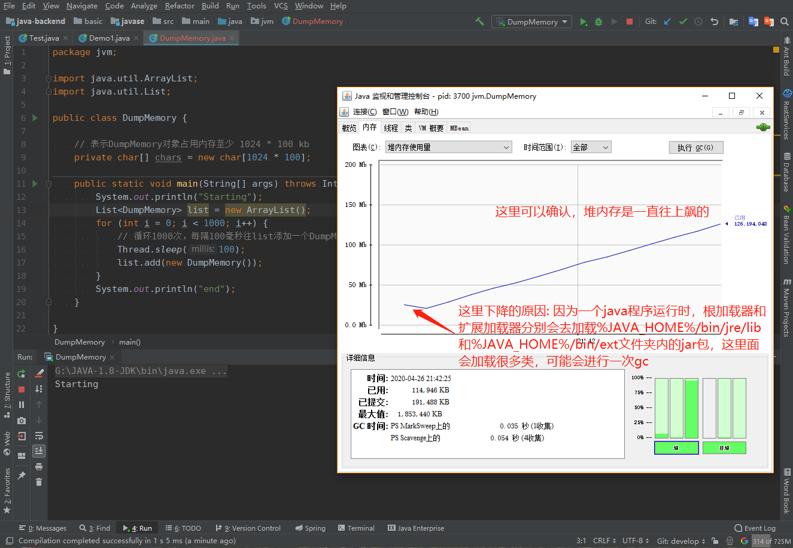
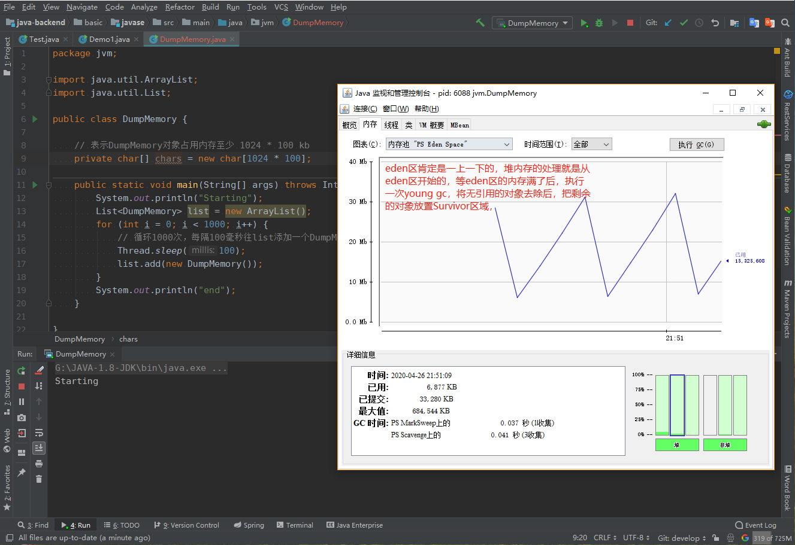
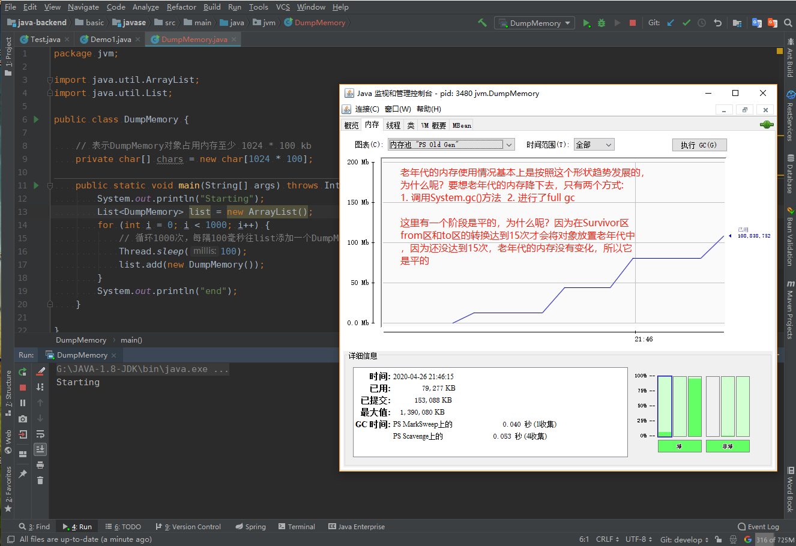
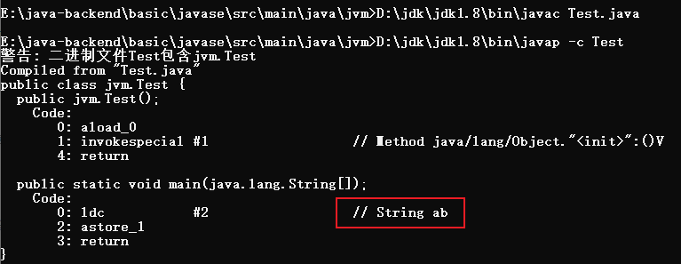
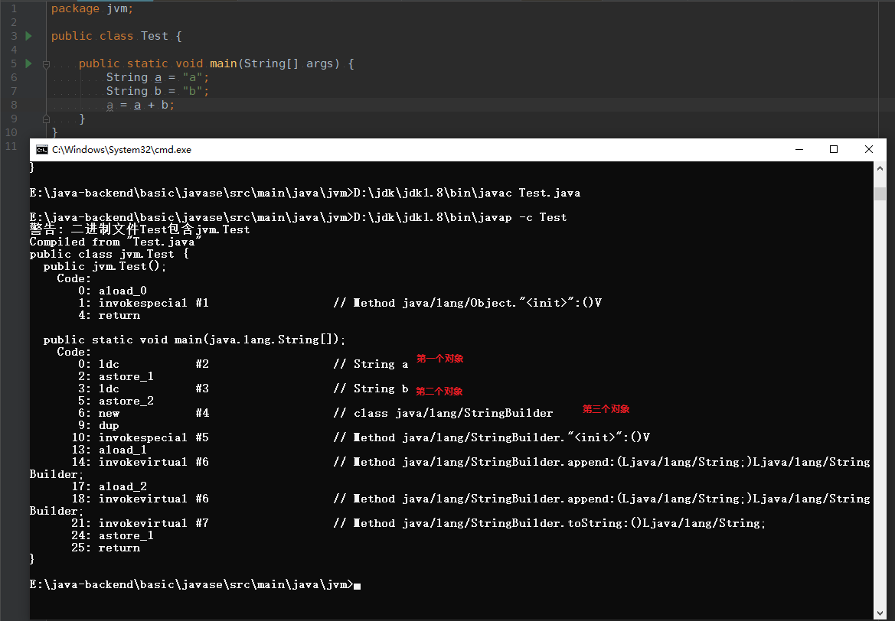
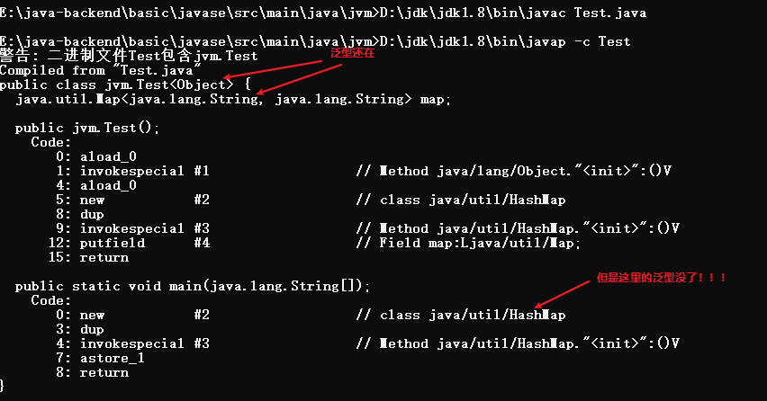
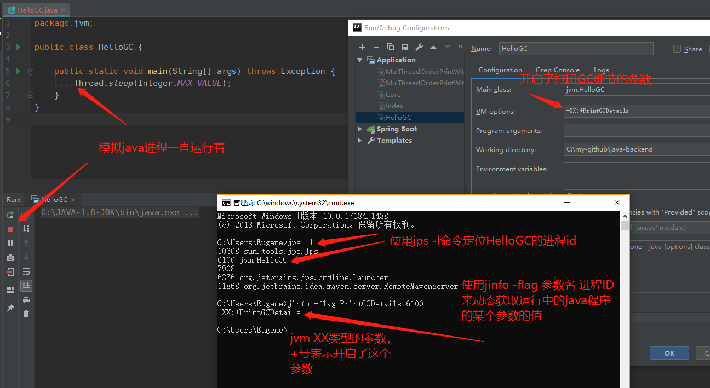

## 一、类加载器类型

* 表格

  |          类加载器类型          |                      作用                       |                           获取方式                           |                   备注                   |
  | :----------------------------: | :---------------------------------------------: | :----------------------------------------------------------: | :--------------------------------------: |
  |   系统加载器(AppClassLoader)   | 加载当前应用`classpath`下的class文件至jvm内存中 | ClassLoader appClassLoader = ClassLoader.getSystemClassLoader() | 线程上下文获取的类加载器就是`系统加载器` |
  |   扩展加载器(ExtClassLoader)   | 加载`%JAVA_HOME%/jre/lib/ext`路径下的所有jar包  |   ClassLoader extClassLoader = appClassLoader.getParent()    |                    无                    |
  | 根加载器(BootstrapClassLoader) |   加载`%JAVA_HOME%/jre/lib`路径下的所有jar包    |   ClassLoader rootClassLoader = extClassLoader.getParent()   |  在java中获取的为null, 因为是由C++写的   |

## 二、如何将一个java文件加载到jvm内存 -- Class.forName() -- "全盘委派机制"

* 大范围就是：将java文件编译成class文件，再使用类加载器将class文件加载到jvm内存中。在这一般会用到Class.forName("全限定名")的api。但是使用这个api有一个特点，就是内部有这么一段代码：

  ```java
  public static Class<?> forName(String className)
                  throws ClassNotFoundException {
      // 拿到调用方的Class类，假设在类A的main方法中调用了Class.forName("com.xxx.xxx");
      // 那么获取到的调用方的Class类就是类A  <==>  caller就是A的class对象。
      // 最终会使用类A的类加载器将com.xxx.xxx类加载到jvm中 <==> ClassLoader.getClassLoader(caller)
      Class<?> caller = Reflection.getCallerClass();
      return forName0(className, true, ClassLoader.getClassLoader(caller), caller);
  }
  ```

## 三、双亲委派机制

* 如图

  

* 双亲委派机制有一个规则：`每一个类加载器只能做自己的工作，假设我们想让BootstrapClassLoader来加载classpath路径下的某个类，这是行不通的(正常情况下)`

## 四、JDBC破坏双亲委派机制案例

* 情况一：（`未破坏双亲委派机制`）

  ```java
  Class.forName("com.mysql.jdbc.Driver");
  Connection connection = DriverManager.getConnection("jdbc:mysql://127.0.0.1:3306/mybatis?useUnicode=true&characterEncoding=utf-8&useSSL=false&allowMultiQueries=true", "root", "");
  System.out.println(connection);
  ```

  解析：

  ```txt
  上面有说到，全局委派机制。因为在我们自定义写的类A中调用了Class.forName("com.mysql.jdbc.Driver");方法，
  所以com.mysql.jdbc.Driver的加载是由AppClassLoader完成的。而且在执行Class.forName("com.mysql.jdbc.Driver")代码时，使用的是扩展类加载器(因为jdbc是第三方jar包)把它加载到jvm中去的，在加载的过程中，调用了com.mysql.jdbc.Driver类的静态代码块。静态代码块的主要逻辑是把mysql的驱动添加到DriverManager的registeredDrivers属性中去了。最后在DriverManager.getConnection方法需要使用到这个驱动类时是直接从registeredDrivers属性中拿驱动获取连接的。
  ```

* 情况二：(`破坏双亲委派机制`)

  ```java
  Connection connection = DriverManager.getConnection("jdbc:mysql://127.0.0.1:3306/mybatis?useUnicode=true&characterEncoding=utf-8&useSSL=false&allowMultiQueries=true", "root", "");
  System.out.println(connection);
  ```

  解析：

  ```txt
  可以看到，我们并没有手动将com.mysql.jdbc.Driver类加载到jvm中去。而DriverManager是java.sql包下的，位于rt.jar包。所以DriverManager肯定是由根加载器加载到jvm的。而在加载DriverManager类时，内部的静态代码会使用java的spi技术。读取classpath下META-INF/services/java.sql.Driver文件，里面存储的就是一些实现了java.sql.Driver接口的实现类。其中就包括com.mysql.jdbc.Driver。我们拿到的还只是字符串，我们要把它加载到jvm中，会用到Class.forName()的api。由上述的全盘委托机制可知，在DriverManager内部执行Class.forName()方法，最终肯定使用的是根加载器。但是com.mysql.jdbc.Driver并不在%JAVA_HOME%/bin/jre/lib路径下，所以肯定是不能加载到的。此时就用到了ClassLoader cl = Thread.currentThread().getContextClassLoader()代码来获取当前线程的类加载器, 此段代码获取的是系统加载器，即AppClassLoader，然后使用Class.forName的另外一个能指定类加载器的api(java.lang.Class#forName(java.lang.String, boolean, java.lang.ClassLoader))去加载类。所以最终是使用系统加载器来加载com.mysql.jdbc.Driver类
  ```

## 五、JVM内存模型

* 结构图

  

* 整理下jvm线程私有的内存结构

  |      类目       |                        作用                        |                             备注                             |
  | :-------------: | :------------------------------------------------: | :----------------------------------------------------------: |
  |   程序计数器    |   类似于pc寄存器，用来存储下一步jvm要处理的指令    |                              无                              |
  |   本地方法栈    | jvm中(eg: hotspot)的原生方法，eg: UNSAFE类中的方法 |                              无                              |
  |      栈帧       |    线程每调用一个方法都会以栈帧的方式存储在栈中    |                              无                              |
  | 栈帧-局部变量表 |               存储方法内部定义的变量               | 1. 方法中具体定义的变量名，在内部都不会存在，jvm不在乎你的变量名是什么<br>2. 当执行store相关指令时，会将变量存储到局部变量表中 |
  |  栈帧-操作数栈  |             临时存储方法内部定义的变量             | 1. 当执行const相关的指令时，会将变量临时存储到操作数栈中<br>2. 当执行load相关指令时，会将局部变量表中的变量移动到操作数栈中 |
  |  栈帧-动态链接  |          java中多态的机制就是靠它来完成的          |                                                              |
  |  栈帧-方法出口  |                 栈帧执行结束的出口                 | 方法结束的出口一共有两个: <br>1. 正常return<br>2.方法出异常  |

  

## 六、JVM堆内存结构与测试

* 结构图

  

* 测试JVM堆内存

  * 测试类:

    ```java
    package jvm;
    
    import java.util.ArrayList;
    import java.util.List;
    
    public class HeapMemory {
    
        // 表示DumpMemory对象占用内存至少 1024 * 100 kb
        private char[] chars = new char[1024 * 100];
    
        public static void main(String[] args) throws InterruptedException {
            System.out.println("Starting");
            List<HeapMemory> list = new ArrayList();
            for (int i = 0; i < 1000; i++) {
                // 循环1000次，每隔100毫秒往list添加一个DumpMemory对象， 最后使用jconsole来定位main线程，来查看堆内存的变化
                Thread.sleep(100);
                list.add(new HeapMemory());
            }
            System.out.println("end");
        }
    }
    ```

  * 使用`jdk`自带的**jconsole**工具进行查看堆内存

    * 整体堆内存

      

    * Eden区

      

    * 老年代

      

## 七、以jvm的角度来查看常见的几个面试题

* Q: String str = "a" + "b"; 一共创建了几个对象？

* A: 一个字符串常量"ab"和一个str引用变量，下图为jvm进行处理的原理

  

---

* Q:

  ```java
  String a = "a";
  String b = "b";
  a = a + b;
  
  一共创建了几个对象？String和StringBuffer的区别？
  ```

* A: 创建了 3个对象, "a", "b"和一个jvm内部创建的`StringBuild`对象，以及a，b两个引用对象. 所以一共创建了5个对象。

  在jvm内部中, 两个字符串对象做拼接，jvm底层会创建一个StringBuild，使用它的append方法做拼接。具体看下图: 

  

---

* Q: 泛型什么时候会被编译擦除？

* A: 在实例方法(局部方法)中定义的变量会被泛型擦除.

  测试代码:

  ```java
  package jvm;
  
  import java.util.HashMap;
  import java.util.Map;
  
  public class Test<Object> {
  
  
      Map<String, String> map = new HashMap<>();
  
  
      public static void main(String[] args) {
          Map<String, String> mapInner = new HashMap<>();
      }
  }
  
  ```

  使用`javap`反编译成指令后的结果:

  

  **结论: 当泛型一定在类上、实例变量上时，它的泛型不会被jvm擦除，但是定义在方法内部的泛型将会被擦除**

---

* Q: try catch时，finally块一定会执行么？
* A: 程序正常运行时，以及正常退出时肯定会被执行。但是如果手动执行`System.exit(0)`代码以及在执行finally代码块之前把进程kill掉了，那就不会被执行了

## 八、jvm工具

### Jinfo

* `jinfo -flags java进程ID`， 可以看到java的运行时环境(jvm的一些参数) , 与java中`System.getProperties()`一致


## 九、常见问题总结

### 一、讲讲jvm内存结构

```txt
jvm分为两个大区域一个是线程间共享的一个是线程私有的

其中线程间共享的区域包含：堆、方法区(存储类的元信息)

线程私有的包含: 程序计数器、栈、本地方法栈

其中栈是指每启动一个线程就会创建一个对应的栈, 线程方法入口处每调用一个方法
就创建一个栈帧
其中栈帧又包括：局部变量表、操作数栈、动态链接、方法出口。

最后再说一下堆结构，在jvm中堆分为新生代、老年代，他们按照1:2的比例分配着堆内存
其中新生代包含eden区、survivor from区、survivor to区。他们分别以8:1:1的比例分配着新生代的内存。
```

### 二、讲讲什么情况下会出现内存溢出，内存泄露？

```txt
内存溢出是指jvm运行的内存满了，一般是指堆内存满了，然后抛出OutOfMemoryException。
出现这种情况时，我们要分析具体的原因：是因为程序的bug(死循环创建引用对象)、还是
因为业务量数据大，jvm的内存无法存储。如果是前者，我们可以使用java自带的jstack命令
来定位到具体的代码行进而解决问题，如果是后者，我们可以更新程序运行的堆内存，具体
更新多大还是要根据实际的项目业务来具体分析。

所谓内存泄露，是指对象有被应用，但是永远不会被使用到。
最常见的就是在使用ThreadLocal中时的内存泄露，因为ThreadLocal存储时，是以threadLocal
自身为key进行存储的，在它底层中，threadLocal存储时指定了key为弱引用，所以当内存不够时，
gc会回收threadLocal这些弱引用，最终导致value对应的key为null，又由于threadLocal的特性，
在获取值时，不可能出获取key为null对应的value，所以造成了内存泄露。
```

### 三、说说Java线程栈 

```txt
参考上述jvm内存结构中描述到的栈数据结构
```

### 四、JVM年轻代到老年代的晋升过程的判断条件是什么？

```txt
首先先介绍下一个对象晋升老年代的过程：
一个对象被new出来时，首先放入的是eden区，当eden区满了之后会触发一次young gc，
此时会将未被回收的对象移至survivor区，当一个对象在survivor区经历了15此young gc
时，就会晋升到老年代。
这是最正常的逻辑，同时也会出现几个特殊情况：
1. 大对象的回收: 当一个对象的大小达到了jvm大对象的定义，此时这个对象就会直接晋升到老年代
2. 对象比eden区大: 当我们new一个对象时，这个对象的内存比eden区还要大，则直接晋升至老年代。 ----------
3. 对象达到了survivor区的50%: 比如在第一次youg gc时，发现有一个对象的大小达到了survivor区的50%时，survivor区无法
存储这个对象，此时这个对象就会直接晋升到老年区。
```

### 五、JVM出现了Full GC很频繁，怎么去线上排查问题？

```txt
首先Full GC会触发STW机制，会让用户线程暂停，保证GC的安全执行，导致系统会出现一段时间的卡顿。
其次，要触发Full GC，一般是老年区快满了或者是自己手动调用了System.gc()，后者一般在真实项目中
不会手动去调用，所以问题一般就出现在前者了。于是我们要去分析项目为什么对象频繁会丢入老年代？
排查方向: 
1. 是否频繁的创建大对象
2. 创建出来的对象大小是否超过了eden区
3. 创建出来的对象大小是否达到了survivor区的50%

如果是线上的项目，想要紧急修复就扩大堆内存。
```

### 六、类加载为什么要使用双亲委派模式，有没有什么场景是打破了这个模式？

```txt
首先双亲委派机制就是每个类加载器一开始不干活，先让自己的父加载器干活，
每个加载器各尽其责，只能做自己分内的事情。所以使用双亲委派机制就保证了，
高效性和安全性。
双亲委派机制可以被打破，比如在加载mysql驱动时，不直接使用Class.forName("com.mysql.jdbc.Driver")代码，
调用。而是直接使用DriverManager获取connect。它的底层原理是ExtClassLoader类加载器拿到了当前线程的
类加载器 以及 使用java spi的机制来破坏的。
```

### 七、类的实例化顺序

```txt
执行父类静态块 -> 子类静态块 -> 父类非静态块 -> 父类构造方法 -> 子类非静态块 -> 子类构造方法
```

### 八、JVM垃圾回收机制，何时触发MinorGC等操作

```txt
当eden区满了
```

### 九、JVM 中一次完整的 GC 流程（从 ygc 到 fgc）是怎样的

```txt
参考第4个问题的分析
```

### 十、各种回收算法

```txt
GC最基础的算法有三种:
标记-清除算法：
分为两个阶段：标记和清除阶段，首先先标记出需要回收的对象，等真正回收时再将标记后的对象进行回收。
缺点：内存不连续，比较碎片，无法存储相对于比较大的对象，最终会触发GC。(明明还有一些连续的内存，只是因为空间不连续的问题，导致不得不触发一次GC)，这种算法基本上不使用了。

复制算法：
将内存按容量划分为大小相等的两块，每次只使用其中的一块。当这一块用完后就将还存活的对象复制到另外
一块内存区域上。解决了标记-清除算法的问题，内存不再碎片化。这种算法适用于堆内新生代的Survivor区。

标记-整理算法：
标记阶段与标记清除算法中的标记方式是一样的。但后续的步骤不一样，是将存活的对象都向一段移动，然后
直接清理掉边界外的对象。适用于老年代

我们常用的垃圾回收器一般是分代收集算法，其实就是结合了上述三种算法
```

### 十一、各种回收器，各自优缺点，重点CMS、G1

```txt
CMS、G1
```

### 十二、OOM错误，stackoverflow错误，permgen space错误


## 十、jvm常见问题与实战

### 10.1 jvm垃圾回收的时候如何确定垃圾？是否知道什么是GC Roots?

```txt
什么是垃圾？
  内存中不再被使用到的空间就是垃圾。
GC Roots(根可达算法)是判断垃圾的一种算法，具体的流程为如下：
  枚举根节点做可达性分析。从所有的根节点开始，挨个遍历，通过他们的依赖关系遍历所有能遍历到的对象，能遍历到的对象就是存活着的。不能遍历到的对象就是“垃圾”，需要被回收。
```

如下区域中的对象可以被视为**根**节点

| jvm中栈帧中的局部变量表 | 方法区中的类静态属性              |
| ----------------------- | --------------------------------- |
| 方法区中的常量          | 本地方法栈中JNI(Native)引用的对象 |

总结就是：**局部变量表、常量、静态属性、JNI引用的对象**

代码示例：

```java
/**
 * 可以被视为根对象的情况
 * 1、栈的栈帧的局部变量表中引用的对象
 * 2、静态属性
 * 3、常量
 * 4、JNI中的native
 */
public class GCRootDemo {

    // 静态属性可以当做根
    private static GCRootDemo1 gcRootDemo1;

    // 常量也可以当做根
    private static final GCRootDemo2 gcRootDemo2 = new GCRootDemo2();

    public static void m1() {
        // 一个方法在调用的时候，就会产生一个栈帧，内部创建的对象就会存到局部变量表中去，因此demo也是一个根对象
        GCRootDemo demo = new GCRootDemo();

        System.gc();
        System.out.println("第一次GC完成");
    }

    public static void main(String[] args) {
        m1();
    }
}

class GCRootDemo1 {}

class GCRootDemo2 {}
```

### 10.2 你说你做过JVM调优和参数配置，请问如何盘点查看JVM系统默认值

* jvm参数类型的种类

  ```txt
  1、标配参数 eg: java -version,   java -help 基本上不会变
  2、x参数(了解)
  3、xx参数  ---- 比较重要
  注意： -Xmx和-Xms这两个参数也属于xx参数
  -Xmx1024m 等同于 --XX:MaxHeapSize=1024m
  -Xms1024m 等同于 --XX:InitialHealSize=1024m
  同时，jvm在加载的过程中，会根据你当前硬件的配置来决定最大堆内存为多少，一般为电脑硬件总内存的1/4
  最小堆内存为1/64
  eg: 电脑为16G，那么最大堆内存就会设置成4G，最小堆内存为0.25G
  ```

* 答案：

  ```txt
  1、使用jps定位java进程id
  2、使用jinfo -flag 具体参数名 进程id ==> 查看具体的某个参数的值
     或者
     使用jinfo -flags 进程id ==> 查看所有的参数值
  ```

#### 10.2.1 xx参数之boolean类型

* 规则： **-XX:+AAA**    **-XX:-BBB**

  ```TXT
  如上规则表示，jvm在启动的时候开启AAA功能，关闭BBB功能
  ```

* 示例：(结合jps + jinfo命令查看)

  

#### 10.2.2 xx参数之K,V类型

* 规则：**-XX:属性key=value**
* 示例：与**10.2.1**类似

### 10.3 查看jvm所有参数

* 方法一：使用 **jinfo -flags 线程id**

* 方法二：

  ```txt
  1、java -XX:PrintFlagsInitial  ==> 列出来的是jvm默认添加的全局参数
  2、java -XX:PrintFlagsFinal  ==> 列出来的是jvm默认添加的全局参数，同时包含一些自定义的参数":="用冒号等号来区别
  ```